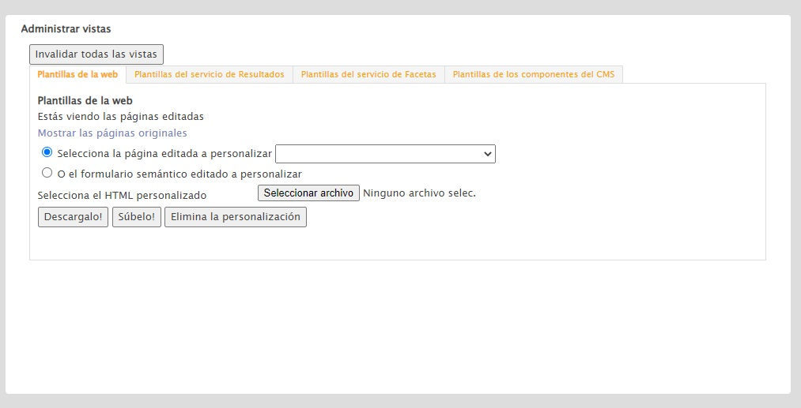
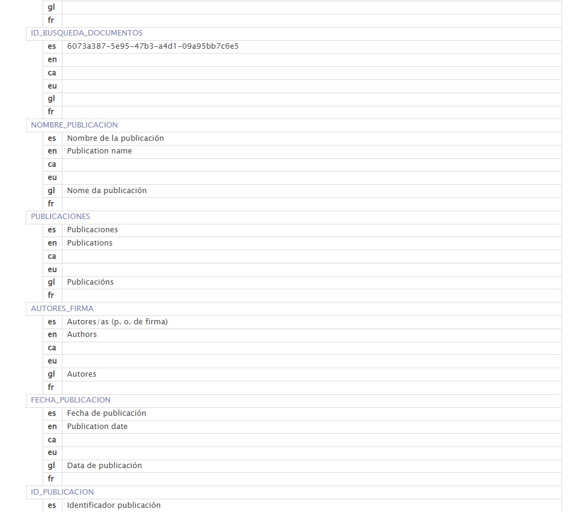
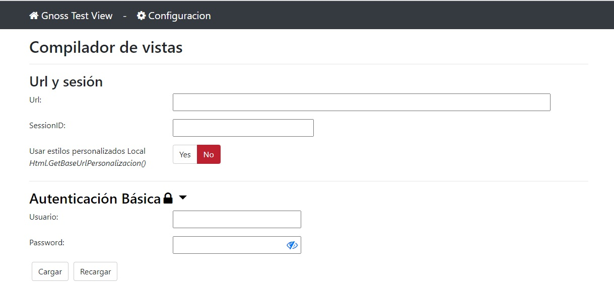
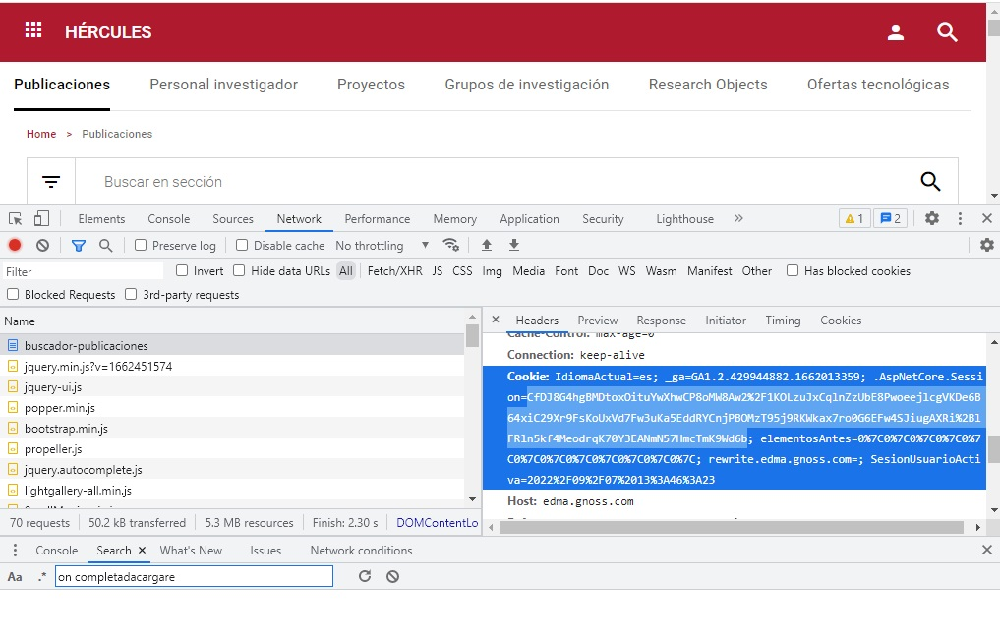

| Fecha                 | 05/09/2022                                |
| --------------------- | ---------------------------------------- |
| Título                | Edición de vistas                        |
| Descripción           | Guía de funcionamiento de la edición de vista|
| Versión               | 1.0                                      |
| Módulo                | Documentación                            |
| Tipo                  | Especificación                           |
| Cambios de la Versión | Versión inicial                          |

# Edición de vistas 

 - [Introducción](#introducción)
 - [Administración de vistas](#administración-de-vistas)
 - [Administración de traducciones](#administración-de-traducciones)
 - [Compilador de vistas](#compilador-de-vistas)
   - [Buscadores](#buscadores) 
   - [Páginas del CMS](#páginas-del-cms) 
   - [Fichas de consulta](#fichas-de-consulta) 

## Introducción
En esta documentación se explican la forma de depurar las vistas usadas en la plataforma (buscadores, páginas del CMS, fichas de consulta...)

## Administración de vistas
La creación/edición/eliminación de vistas se realiza desde la página {URL_COMUNIDAD}/administrar-vistas accesible por el administrador.  
Dentro de esta página hay varias secciones:
 - Plantillas de la web: Dentro de esta sección se encuentran las vistas de la web excepto las del CMS
   - Páginas generales: Aquí se encuentran las vistas generales (todas excepto las de las fichas de los recursos)
   - Fichas de recursos: Aquí se encuentran las vistas de las fichas de los recursos 
 - Plantillas del servicio de resultados: Dentro de esta sección se encuentran las vistas utilizadas en el servicio de resultados
 - Plantillas del servicio de facetas: Dentro de esta sección se encuentran las vistas utilizadas en el servicio de facetas
 - Plantillas de los componentes del CMS: Dentro de esta sección se encuentran las vistas de los componentes del CMS

## Administración de traducciones
Desde esta página se pudeden editar los textos de las traducciones incluidos en las vistas desde la página {URL_COMUNIDAD}/administrar-traducciones accesible por el administrador.  

## Compilador de vistas
El compilador de vistas nos servirá para depurar vistas y poder editar/crear vistas.  
Se encuentra en la siguiente URL: [Compilador de vistas](https://github.com/equipognoss/Gnoss.DevTools.ViewMaker)

Para depurar las vistas hay que copiar las vistas del repositorio [https://github.com/HerculesCRUE/HerculesED/tree/main/Web/Views](https://github.com/HerculesCRUE/HerculesED/tree/main/Web/Views) (Carpetas CMS, Recursos y Views) dentro de la solución en /Views/hercules/

Para cargar una página hay que configurar lo siguiente:
 - Url: La URL de la página que queremos depurar.
 - Autenticación Básica/Usuario: Usuario para la autenticación HTTP en caso de que esté configurada.
 - Autenticación Básica/Password: Contraseña para la autenticación HTTP en caso de que esté configurada.
 - SessionID: Si no se introduce se comportaría como si navegase un usuario invitado. Se puede introducir el ID de sesión de un usuario para que la página se cargue como si fuese ese usuario el que está navegando, para ello hay que recuperarlo de la cookie '.AspNetCore.Session'

### Buscadores
Las vistas personalizadas involucradas en los búscadores son:
 - [Views/Busqueda/Index.cshtml](https://github.com/HerculesCRUE/HerculesED/blob/main/Web/Views/Views/Busqueda/Index.cshtml): La vista que se carga en la Web que tiene los contenedores para cargar las facetas y los resultados.
 - [Views/CargadorFacetas/_Faceta.cshtml](https://github.com/HerculesCRUE/HerculesED/blob/main/Web/Views/Views/CargadorFacetas/_Faceta.cshtml): La vista que se encarga de pintar una faceta.
 - [Views/CargadorFacetas/_ItemFaceta.cshtml](https://github.com/HerculesCRUE/HerculesED/blob/main/Web/Views/Views/CargadorFacetas/_ItemFaceta.cshtml): La vista que se encarga de pintar un ítem de una faceta.
 - [Views/CargadorResultados/CargadorResultados.cshtml](https://github.com/HerculesCRUE/HerculesED/blob/main/Web/Views/Views/CargadorResultados/CargarResultados.cshtml): La vista que se encarga de pintar el listado de resultados.
 - [Views/CargadorResultados/_ResultadoRecurso.cshtml](https://github.com/HerculesCRUE/HerculesED/blob/main/Web/Views/Views/CargadorResultados/_ResultadoRecurso.cshtml): La vista que se encarga de pintar un ítem dentro de los resultados.

### Páginas del CMS
Las vistas personalizadas involucradas en los componentes del CMS se encuentran en la siguiente URL [https://github.com/HerculesCRUE/HerculesED/tree/main/Web/Views/CMS](https://github.com/HerculesCRUE/HerculesED/tree/main/Web/Views/CMS).

### Fichas de consulta
Las vistas personalizadas involucradas en las fichas de consulta se encuentran en la siguiente URL [https://github.com/HerculesCRUE/HerculesED/tree/main/Web/Views/Recursos](https://github.com/HerculesCRUE/HerculesED/tree/main/Web/Views/Recursos).  

Adicionalmente las fichas de consulta pueden utilizar métodos específicos creados en el [servicio externo](https://github.com/HerculesCRUE/HerculesMA/tree/main/src/Hercules.MA.ServicioExterno) para realizar determinadas acciones como el pintado de gráficas

También pueden incluir buscadores, reutilizando el funcionamiento de los servicios de facetas y de resultados

