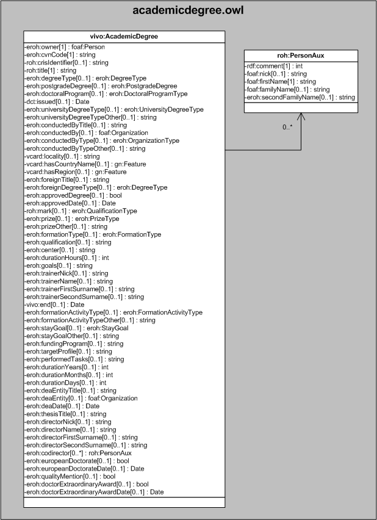

| Fecha         | 15/03/2022                                                   |
| ------------- | ------------------------------------------------------------ |
|Título|Objeto de Conocimiento AcademicDegree| 
|Descripción|Descripción del objeto de conocimiento AcademicDegree para Hércules|
|Versión|1.0|
|Módulo|Documentación|
|Tipo|Especificación|
|Cambios de la Versión|Versión inicial|

# Hércules ED. Objeto de conocimiento AcademicDegree

La entidad vivo:AcademicDegree (ver Figura 1) representa la formación recibida por el titular del CV relativa a enseñanzas universitarias y artísticas superiores y de especialización, tanto oficiales como no oficiales.

Una instancia de vivo:AcademicDegree se asocia con las siguientes entidades a través de propiedades de objeto:

- [foaf:Person](https://github.com/HerculesCRUE/Commons-ED-MA/tree/main/ObjetosDeConocimiento/Person), representa a la persona asociada al ítem.
- [eroh:DegreeType](https://github.com/HerculesCRUE/Commons-ED-MA/tree/main/ObjetosDeConocimiento/DegreeType), representa el tipo de titulación.
- [eroh:PostgradeDegree](https://github.com/HerculesCRUE/Commons-ED-MA/tree/main/ObjetosDeConocimiento/PostgradeDegree), representa un ítem referenciando una titulación de posgrado.
- [eroh:DoctoralProgramType](https://github.com/HerculesCRUE/Commons-ED-MA/tree/main/ObjetosDeConocimiento/DoctoralProgramType), representa el tipo de programa de doctorado.
- [eroh:UniversityDegreeType](https://github.com/HerculesCRUE/Commons-ED-MA/tree/main/ObjetosDeConocimiento/UniversityDegreeType), representa el tipo de titulación universitaria.
- [foaf:Organization](https://github.com/HerculesCRUE/Commons-ED-MA/tree/main/ObjetosDeConocimiento/Organization), representa una entidad referenciada al ítem.
- [eroh:OrganizationType](https://github.com/HerculesCRUE/Commons-ED-MA/tree/main/ObjetosDeConocimiento/OrganizationType), representa el tipo de entidad.
- [gn:Feature](https://github.com/HerculesCRUE/Commons-ED-MA/tree/main/ObjetosDeConocimiento/Feature), representa el país y comunidad autónoma o región.
- [eroh:QualificationType](https://github.com/HerculesCRUE/Commons-ED-MA/tree/main/ObjetosDeConocimiento/QualificationType), representa el tipo de nota media del expediente.
- [eroh:PrizeType](https://github.com/HerculesCRUE/Commons-ED-MA/tree/main/ObjetosDeConocimiento/PrizeType), representa el tipo de premio obtenido.
- [eroh:FormationType](https://github.com/HerculesCRUE/Commons-ED-MA/tree/main/ObjetosDeConocimiento/FormationType), representa el tipo de formación(nivel académico de los estudios cursados).
- [eroh:FormationActivityType](https://github.com/HerculesCRUE/Commons-ED-MA/tree/main/ObjetosDeConocimiento/FormationActivityType), representa el tipo de la formación (carácter del curso de especialización realizado).
- [eroh:StayGoal](https://github.com/HerculesCRUE/Commons-ED-MA/tree/main/ObjetosDeConocimiento/StayGoal), representa el objetivo que se pretende alcanzar.
- roh:PersonAux, representa los codirectores del ítem, representados por su orden, firma, nombre y apellidos.

*Figura 1. Diagrama ontológico para la entidad eroh:AcademicDegree*
