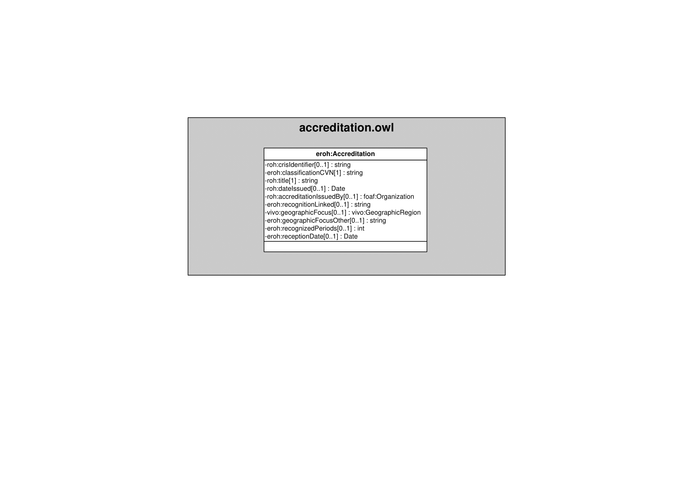

| Fecha         | 09/12/2021                                                   |
| ------------- | ------------------------------------------------------------ |
|Título|Objeto de Conocimiento Accreditation| 
|Descripción|Descripción del objeto de conocimiento Accreditation para Hércules|
|Versión|1.0|
|Módulo|Documentación|
|Tipo|Especificación|
|Cambios de la Versión|Versión inicial|

# Hércules ED. Objeto de conocimiento Accreditation

La entidad eroh:Accreditation (ver Figura 1) representa todas aquellas acreditaciones y méritos obtenidos por un investigador.
Además de propiedades contenidas en ROH, como roh:crisIdentifier, roh:title, roh:dateIssued o roh:accreditationIssuedBy, se han añadido ciertas propiedades que extienden la ontología fundamental con el fin de dar respuesta a las necesidades de gestión de datos requeridas durante el desarrollo de la infraestructura Hércules EDMA.

Una instancia de eroh:Accreditation se asocia con las siguientes entidades a través de propiedades de objeto:

- [foaf:Person](https://github.com/HerculesCRUE/Commons-ED-MA/tree/main/ObjetosDeConocimiento/Person), representa a la persona asociada a la acreditación.
- [foaf:Organization](https://github.com/HerculesCRUE/Commons-ED-MA/tree/main/ObjetosDeConocimiento/Organization), que vincula el reconocimiento con la entidad que lo ha otorgado o acreditado.
- [eroh:OrganizationType](https://github.com/HerculesCRUE/Commons-ED-MA/tree/main/ObjetosDeConocimiento/OrganizationType), representa el tipo de entidad.
- [gn:Feature](https://github.com/HerculesCRUE/Commons-ED-MA/tree/main/ObjetosDeConocimiento/Feature), representa el país y la comunidad autónoma o región.
- [vivo:GeographicRegion](https://github.com/HerculesCRUE/Commons-ED-MA/tree/main/ObjetosDeConocimiento/GeographicRegion), que vincula una acreditación con el ámbito geográfico al que pertenece.

*Figura 1. Diagrama ontológico para la entidad eroh:Accreditation*
