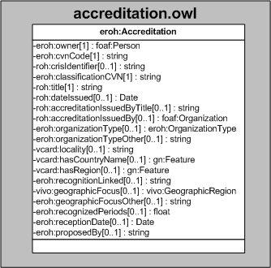

| Fecha         | 09/12/2021                                                   |
| ------------- | ------------------------------------------------------------ |
|Título|Objeto de Conocimiento Acreditación| 
|Descripción|Descripción del objeto de conocimiento Acreditación para Hércules|
|Versión|1.0|
|Módulo|Documentación|
|Tipo|Especificación|
|Cambios de la Versión|Versión inicial|

# Hércules ED. Objeto de conocimiento Acreditación

La entidad eroh:Accreditation (ver Figura 1) representa todas aquellas acreditaciones y méritos obtenidos por un investigador.
Además de propiedades contenidas en ROH, como roh:crisIdentifier, roh:title, roh:dateIssued o roh:accreditationIssuedBy, se han añadido ciertas propiedades que extienden la ontología fundamental con el fin de dar respuesta a las necesidades de gestión de datos requeridas durante el desarrollo de la infraestructura Hércules EDMA.

Las propiedades extendidas son las siguientes:
- eroh:classificationCVN
- eroh:recognitionLinked
- eroh:geographicFocusOther
- eroh:recognizedPeriods
- eroh:receptionDate

Una instancia de eroh:Accreditation se asocia con las siguientes entidades a través de propiedades de objeto:

- foaf:Organization, que vincula el reconocimiento con la entidad que lo ha otorgado o acreditado.
- vivo:GeographicRegion, que vincula una acreditación con el ámbito geográfico al que pertenece.

*Figura 1. Diagrama ontológico para la entidad eroh:Accreditation*
