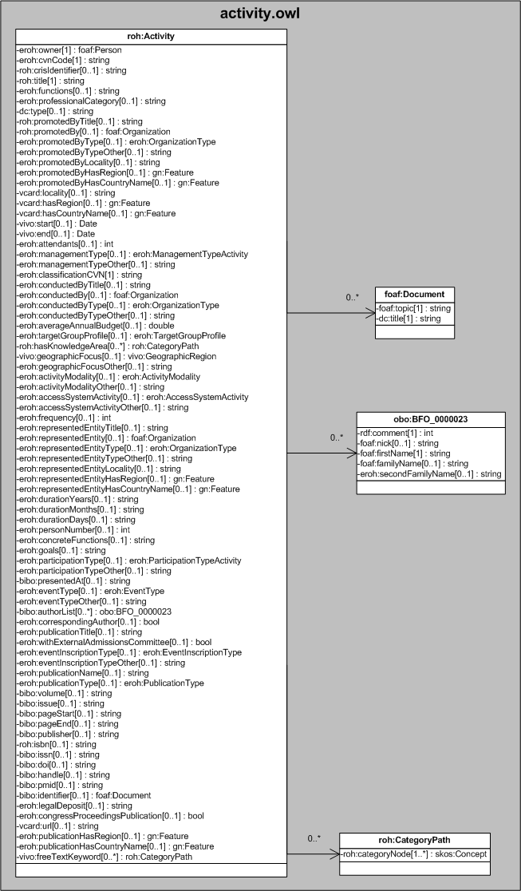

| Fecha         | 09/12/2021                                                   |
| ------------- | ------------------------------------------------------------ |
|Título|Objeto de Conocimiento Activity| 
|Descripción|Descripción del objeto de conocimiento Activity para Hércules|
|Versión|1.0|
|Módulo|Documentación|
|Tipo|Especificación|
|Cambios de la Versión|Versión inicial|

# Hércules ED. Objeto de conocimiento Activity

La entidad roh:Activity (ver Figura 1) representa cualquier tipo de actividad de I+D+i llevada a cabo por un investigador. La especialización de dicha entidad incorpora algunas propiedades de los dominios de investigación, además de las correspondientes a la ontología fundamental empleada en ASIO.
Por otra parte, se han añadido ciertas propiedades que extienden la ontología fundamental con el fin de dar respuesta a las necesidades de gestión de datos requeridas durante el desarrollo de la infraestructura Hércules EDMA.

Los subtipos de actividad están relacionados con sus correspondientes epígrafes en la norma CVN a través de los valores descritos en la propiedad eroh:classificationCVN.

Una instancia de roh:Activity se asocia con las siguientes entidades a través de propiedades de objeto:

- [foaf:Person](https://github.com/HerculesCRUE/Commons-ED-MA/tree/main/ObjetosDeConocimiento/Person), representa a la persona asociada a la actividad.
- [foaf:Organization](https://github.com/HerculesCRUE/Commons-ED-MA/tree/main/ObjetosDeConocimiento/Organization), que vincula una actividad con la entidad convocante (roh:promotedBy) y la entidad de realización (eroh:conductedBy).
- [eroh:OrganizationType](https://github.com/HerculesCRUE/Commons-ED-MA/tree/main/ObjetosDeConocimiento/OrganizationType), representa el tipo de organización.
- [vivo:GeographicRegion](https://github.com/HerculesCRUE/Commons-ED-MA/tree/main/ObjetosDeConocimiento/GeographicRegion), que representa el ámbito geográfico de una actividad.
- [gn:Feature](https://github.com/HerculesCRUE/Commons-ED-MA/tree/main/ObjetosDeConocimiento/Feature), que relaciona la actividad con el país (vcard:hasCountryName) y la región (vcard:hasRegion) donde se desarrolla.
- [eroh:ManagementTypeActivity](https://github.com/HerculesCRUE/Commons-ED-MA/tree/main/ObjetosDeConocimiento/ManagementTypeActivity), que representa la tipología de la gestión de dicha actividad llevada a cabo por el investigador.
- [eroh:TargetGroupProfile](https://github.com/HerculesCRUE/Commons-ED-MA/tree/main/ObjetosDeConocimiento/TargetGroupProfile), que indica el perfil profesional de los participantes en la actividad.
- roh:CategoryPath, que representa mediante un esquema jerárquico el tesauro con las áreas temáticas descriptoras de la actividad.
- [eroh:ActivityModality](https://github.com/HerculesCRUE/Commons-ED-MA/tree/main/ObjetosDeConocimiento/ActivityModality), que indica el tipo de evaluación/revisión practicada por el investigador sobre una actividad.
- [eroh:AccessSystemActivity](https://github.com/HerculesCRUE/Commons-ED-MA/tree/main/ObjetosDeConocimiento/AccessSystemActivity), representa el procedimiento por el que accedió al puesto de gestión.
- [eroh:ParticipationTypeActivity](https://github.com/HerculesCRUE/Commons-ED-MA/tree/main/ObjetosDeConocimiento/ParticipationTypeActivity), representa la modalidad de participación en la organización.
- [eroh:EventType](https://github.com/HerculesCRUE/Commons-ED-MA/tree/main/ObjetosDeConocimiento/EventType), representa el tipo de evento.
- obo:BFO_0000023, representa nombre, apellidos y firma de una persona, además del orden(rdf:comment).
- [eroh:EventInscriptionType](https://github.com/HerculesCRUE/Commons-ED-MA/tree/main/ObjetosDeConocimiento/EventInscriptionType), representa el tipo de intervención.
- [eroh:PublicationType](https://github.com/HerculesCRUE/Commons-ED-MA/tree/main/ObjetosDeConocimiento/PublicationType), representa el tipo de publicación.
- [foaf:Document](https://github.com/HerculesCRUE/Commons-ED-MA/tree/main/ObjetosDeConocimiento/Document), representa el documento asociado.

*Figura 1. Diagrama ontológico para la entidad roh:Activity*
