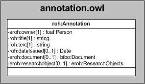

| Fecha         | 09/12/2021                                                   |
| ------------- | ------------------------------------------------------------ |
|Título|Objeto de Conocimiento Annotation| 
|Descripción|Descripción del objeto de conocimiento Annotation para los ROs de Hércules|
|Versión|1.0|
|Módulo|Documentación|
|Tipo|Especificación|
|Cambios de la Versión|Versión inicial|

# Hércules ED. Objeto de conocimiento Annotation

La entidad eroh:Annotation (ver Figura 1) representa anotaciones realizadas por el personal investigador sobre diferentes ROs, ya sean suyos o de terceras personas.
Se han añadido ciertas propiedades que extienden la ontología fundamental con el fin de dar respuesta a las necesidades de gestión de datos requeridas durante el desarrollo de la infraestructura Hércules EDMA.

Una instancia de eroh:Annotation se asocia con las siguientes entidades a través de propiedades de objeto:

- [foaf:Person](https://github.com/HerculesCRUE/Commons-ED-MA/tree/main/ObjetosDeConocimiento/Person), representa la persona asociada a la anotación.
- [bibo:Document](), representa el documento sobre el que se ha anotado.
- [eroh:ResearchObjects](), representa el RO sobre el que se ha anotado.

*Figura 1. Diagrama ontológico para la entidad eroh:Annotation*
