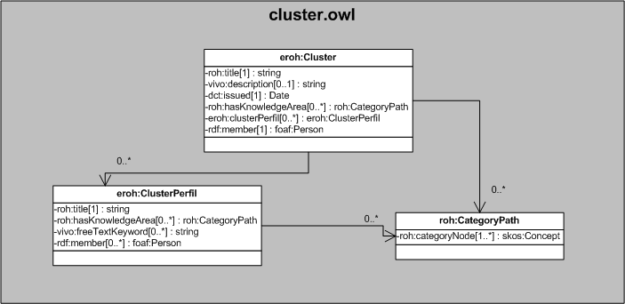

| Fecha         | 15/03/2022                                                   |
| ------------- | ------------------------------------------------------------ |
|Título|Objeto de Conocimiento Cluster| 
|Descripción|Descripción del objeto de conocimiento Cluster para Hércules|
|Versión|1.0|
|Módulo|Documentación|
|Tipo|Especificación|
|Cambios de la Versión|Versión inicial|

# Hércules ED. Objeto de conocimiento Cluster

La entidad eroh:Cluster (ver Figura 1) representa un cluster de investigadores.

Una instancia de eroh:Cluster se asocia con las siguientes entidades a través de propiedades de objeto:

- roh:CategoryPath, representa las áreas temáticas.
- eroh:ClusterPerfil, representa los perfiles definidos en el cluster.
- [foaf:Person](https://github.com/HerculesCRUE/Commons-ED-MA/tree/main/ObjetosDeConocimiento/Person), representa los miembros asociados al cluster.

*Figura 1. Diagrama ontológico para la entidad eroh:Cluster*
