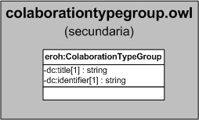

| Fecha         | 15/03/2022                                                   |
| ------------- | ------------------------------------------------------------ |
|Título|Objeto de Conocimiento ColaborationTypeGroup| 
|Descripción|Descripción del objeto de conocimiento ColaborationTypeGroup para Hércules|
|Versión|1.0|
|Módulo|Documentación|
|Tipo|Especificación|
|Cambios de la Versión|Versión inicial|

# Hércules ED. Objeto de conocimiento ColaborationTypeGroup

La entidad eroh:ColaborationTypeGroup (ver Figura 1) representa el tipo de clases de colaboración en el Curriculum Vitae en la plataforma Hércules. Dispone de varias opciones:
- Coautoría de cooperación internacional
- Coautoría de modos protegidos de tecnología
- Coautoría de proyectos y de su desarrollo
- Coautoría de publicaciones
- Coautoría coop con terceras entidades nacionales
- Colaboración en formación a terceros

A continuación se listan todas aquellas propiedades contenidas en eroh:ColaborationTypeGroup que extienden la ontología fundamental ROH con el fin de ajustarse a las necesidades de Hércules EDMA:

- dc:title
- dc:identifier

*Figura 1. Diagrama ontológico para la entidad eroh:ColaborationTypeGroup*
