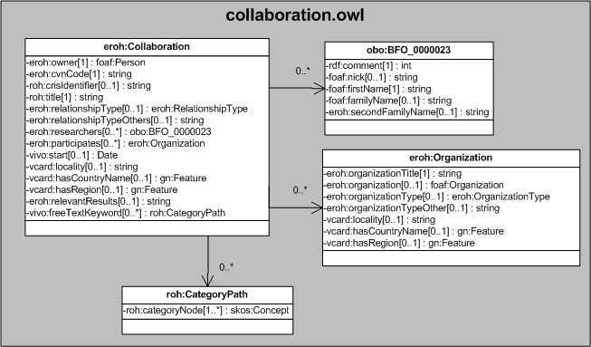

| Fecha         | 09/12/2021                                                   |
| ------------- | ------------------------------------------------------------ |
|Título|Objeto de Conocimiento Collaboration| 
|Descripción|Descripción del objeto de conocimiento Collaboration para Hércules|
|Versión|1.0|
|Módulo|Documentación|
|Tipo|Especificación|
|Cambios de la Versión|Versión inicial|

# Hércules ED. Objeto de conocimiento Collaboration

La entidad eroh:Collaboration (ver Figura 1) representa otros modos de colaboración con equipos de investigación, tanto públicos como privados (incluida la colaboración mixta público-privada en cualquiera de sus modalidades), nacionales o internacionales, de reconocido prestigio a criterio del titular del CV.
Se han añadido ciertas propiedades que extienden la ontología fundamental con el fin de dar respuesta a las necesidades de gestión de datos requeridas durante el desarrollo de la infraestructura Hércules EDMA.

Se han incluido ciertas propiedades VCARD básicas, como vcard:locality, vcard:hasCountryName y vcard:Region, con las cuales referenciar el marco geográfico en el que se desarrolla la colaboración.

Una instancia de eroh:Collaboration se asocia con las siguientes entidades a través de propiedades de objeto:

- [foaf:Person](https://github.com/HerculesCRUE/Commons-ED-MA/tree/main/ObjetosDeConocimiento/Person), representa a la persona asociada con el ítem.
- [eroh:RelationshipType](https://github.com/HerculesCRUE/Commons-ED-MA/tree/main/ObjetosDeConocimiento/RelationshipType), empleada para representar la modalidad de colaboración desarrollada entre investigadores.
- obo:BFO_0000023, que vincula la colaboración con cada uno de los investigadores que participan en ella.
- [foaf:Organization](https://github.com/HerculesCRUE/Commons-ED-MA/tree/main/ObjetosDeConocimiento/Organization), que representa la entidad o entidades que participan en la colaboración.
- [gn:Feature](https://github.com/HerculesCRUE/Commons-ED-MA/tree/main/ObjetosDeConocimiento/Feature), para las diversas representaciones geoespaciales.
- roh:CategoryPath, que representa mediante un esquema jerárquico el tesauro con las áreas temáticas descriptoras de la colaboración.

*Figura 1. Diagrama ontológico para la entidad eroh:Collaboration*
