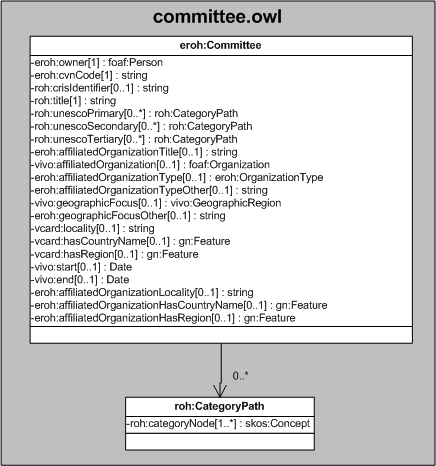

| Fecha         | 09/12/2021                                                   |
| ------------- | ------------------------------------------------------------ |
|Título|Objeto de Conocimiento Comité| 
|Descripción|Descripción del objeto de conocimiento Comité para Hércules|
|Versión|1.0|
|Módulo|Documentación|
|Tipo|Especificación|
|Cambios de la Versión|Versión inicial|

# Hércules ED. Objeto de conocimiento Comité

La entidad eroh:Committee (ver Figura 1) representa comités científicos, técnicos o asesores de los que ha formado parte el investigador.
Se emplean propiedades de los vocabularios VIVO, VCARD y de la ontología fundamental ROH, añadiéndose una única propiedad extendida (eroh:geographicFocusOther).

Una instancia de eroh:Committee se asocia con las siguientes entidades a través de propiedades de objeto:

- roh:CategoryPath, que representa mediante un esquema jerárquico el tesauro con las áreas temáticas descriptoras del comité.
- foaf:Organization, que vincula un comité con su entidad de afiliación.
- vivo:GeographicRegion, que representa el ámbito geográfico del comité.
- gn:Feature, que relaciona el comité con el país (vcard:hasCountryName) y la región (vcard:hasRegion) a los que pertenece.

*Figura 1. Diagrama ontológico para la entidad eroh:Committee*
