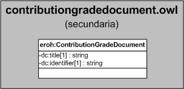

| Fecha         | 15/03/2022                                                   |
| ------------- | ------------------------------------------------------------ |
|Título|Objeto de Conocimiento ContributionGradeDocument| 
|Descripción|Descripción del objeto de conocimiento ContributionGradeDocument para Hércules|
|Versión|1.0|
|Módulo|Documentación|
|Tipo|Especificación|
|Cambios de la Versión|Versión inicial|

# Hércules ED. Objeto de conocimiento ContributionGradeDocument

La entidad eroh:ContributionGradeDocument (ver Figura 1) representa el grado de contribución en el Curriculum Vitae en la plataforma Hércules. Dispone de varias opciones:
- Autor/a o coautor/a de artículo en revista con comité evaluador de admisión externo.
- Autor/a o coautor/a de artículo en revista sin comité externo evaluador de admisión.
- Autor/a o coautor/a de capítulo de libro.
- Autor/a o coautor/a de documento científico o técnico de difusión.
- Autor/a o coautor/a de documento científico-técnico de difusión reservada.
- Autor/a o coautor/a de libro completo.
- Autor/a o coautor/a de nota crítica o recensión publicada.
- Autor/a o coautor/a de obra artística.
- Autor/a o coautor/a de publicación de carácter divulgativo.
- Autor/a o coautor/a de revisión.
- Edito/a o coeditor/a.

*Figura 1. Diagrama ontológico para la entidad eroh:ContributionGradeDocument*
