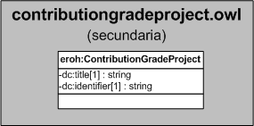

| Fecha         | 15/03/2022                                                   |
| ------------- | ------------------------------------------------------------ |
|Título|Objeto de Conocimiento ContributionGradeProject| 
|Descripción|Descripción del objeto de conocimiento ContributionGradeProject para Hércules|
|Versión|1.0|
|Módulo|Documentación|
|Tipo|Especificación|
|Cambios de la Versión|Versión inicial|

# Hércules ED. Objeto de conocimiento ContributionGradeProject

La entidad eroh:ContributionGradeProject (ver Figura 1) representa el tipo de grado de contribución en el Curriculum Vitae en la plataforma Hércules. 
Dispone de varias opciones:
- Coordinador/a científico/a
- Coordinador del proyecto total, red o consorcio
- Coordinador/a gerente
- Investigador/a
- Técnico/a
- Titulado/a universitario/a en formación
- Otros

A continuación se listan todas aquellas propiedades contenidas en eroh:ContributionGradeProject que extienden la ontología fundamental ROH con el fin de ajustarse a las necesidades de Hércules EDMA:

- dc:title
- dc:identifier

*Figura 1. Diagrama ontológico para la entidad eroh:ContributionGradeProject*
