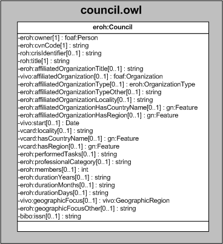

| Fecha         | 09/12/2021                                                   |
| ------------- | ------------------------------------------------------------ |
|Título|Objeto de Conocimiento Council| 
|Descripción|Descripción del objeto de conocimiento Council para Hércules|
|Versión|1.0|
|Módulo|Documentación|
|Tipo|Especificación|
|Cambios de la Versión|Versión inicial|

# Hércules ED. Objeto de conocimiento Council

La entidad eroh:Council (ver Figura 1) representa consejos editoriales de revistas científicas, consejos asesores o de redacción y comités editoriales en los que el titular del CV ha participado.

Se han añadido ciertas propiedades que extienden la ontología fundamental con el fin de dar respuesta a las necesidades de gestión de datos requeridas durante el desarrollo de la infraestructura Hércules EDMA.

Se han incluido en esta entidad propiedades asociadas a la participación del investigador en el consejo editorial, como vivo:start o eroh:durationYears, eroh:durationMonths y eroh:durationDays, que expresan los periodos de pertenencia del investigador al consejo editorial. 

Una instancia de eroh:Council se asocia con las siguientes entidades a través de propiedades de objeto:

- [foaf:Person](https://github.com/HerculesCRUE/Commons-ED-MA/tree/main/ObjetosDeConocimiento/Person), representa a la persona asociada al congreso.
- [foaf:Organization](https://github.com/HerculesCRUE/Commons-ED-MA/tree/main/ObjetosDeConocimiento/Organization), que vincula el consejo editorial con la entidad a la que está afiliado (vivo:affiliatedOrganization).
- [eroh:OrganizationType](https://github.com/HerculesCRUE/Commons-ED-MA/tree/main/ObjetosDeConocimiento/OrganizationType), representa el tipo de entidad.
- [gn:Feature](https://github.com/HerculesCRUE/Commons-ED-MA/tree/main/ObjetosDeConocimiento/Feature), que relaciona el consejo editorial con el país (vcard:hasCountryName) y la región (vcard:hasRegion) donde se desarrolla.
- [vivo:GeographicRegion](https://github.com/HerculesCRUE/Commons-ED-MA/tree/main/ObjetosDeConocimiento/GeographicRegion), que representa el ámbito geográfico del consejo editorial.

*Figura 1. Diagrama ontológico para la entidad eroh:Council*
