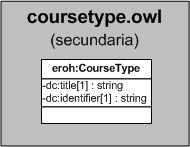

| Fecha         | 15/03/2022                                                   |
| ------------- | ------------------------------------------------------------ |
|Título|Objeto de Conocimiento CourseType| 
|Descripción|Descripción del objeto de conocimiento CourseType para Hércules|
|Versión|1.0|
|Módulo|Documentación|
|Tipo|Especificación|
|Cambios de la Versión|Versión inicial|

# Hércules ED. Objeto de conocimiento CourseType

La entidad eroh:CourseType (ver Figura 1) representa el tipo de asignatura en el Curriculum Vitae en la plataforma Hércules. Dispone de varias opciones:
- Troncal
- Obligatoria
- Optativa
- Libre configuración
- Doctorado/a
- Otros

A continuación se listan todas aquellas propiedades contenidas en eroh:CourseType que extienden la ontología fundamental ROH con el fin de ajustarse a las necesidades de Hércules EDMA:

- dc:title
- dc:identifier

*Figura 1. Diagrama ontológico para la entidad eroh:CourseType*
