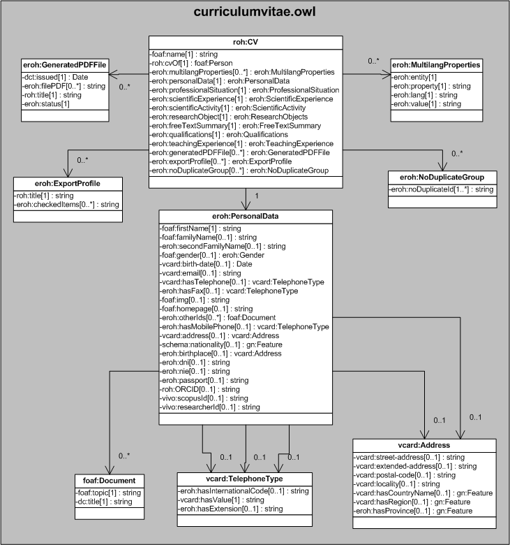
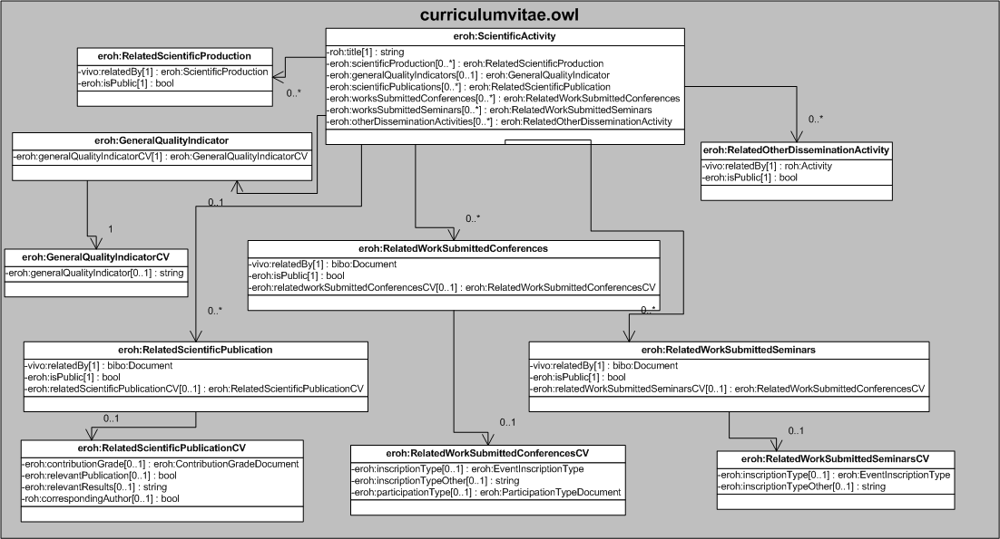
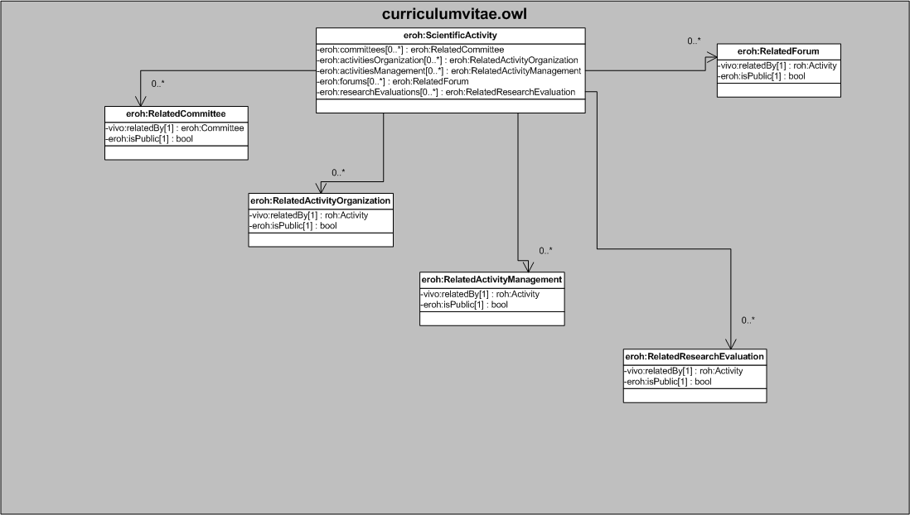
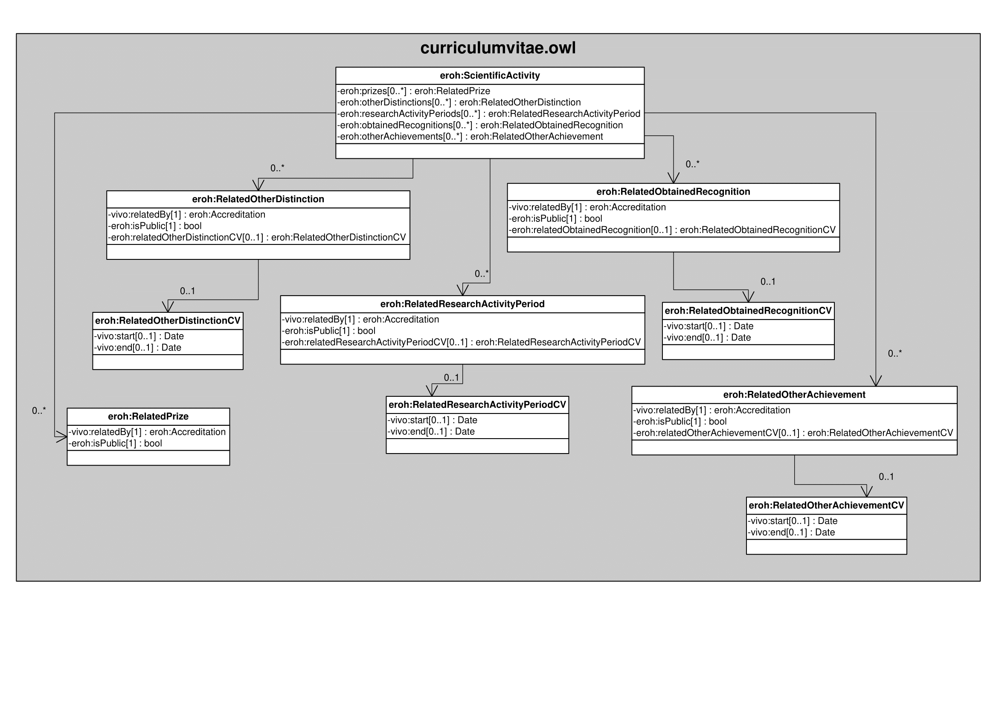
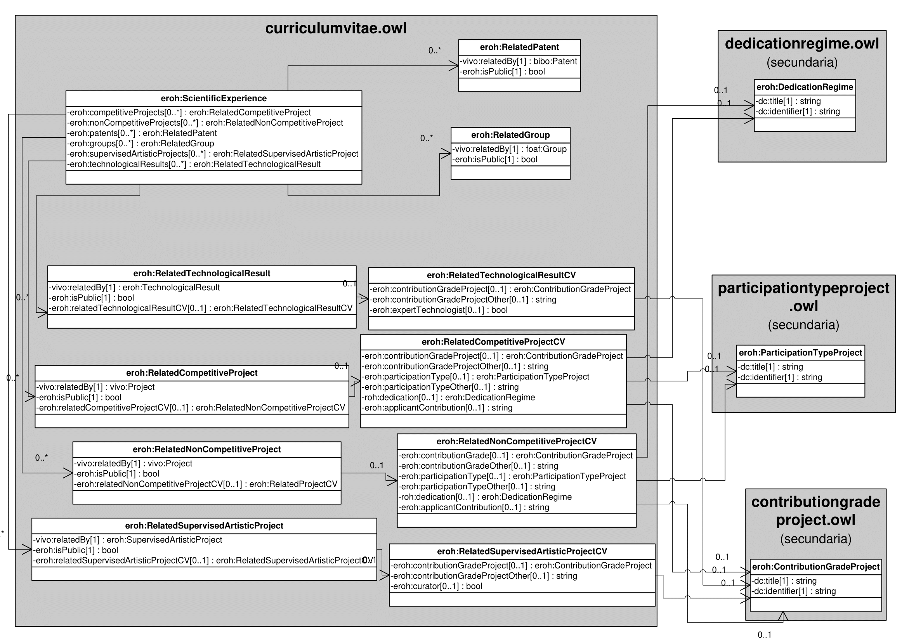

| Fecha         | 08/12/2021                                                   |
| ------------- | ------------------------------------------------------------ |
|Título|Objetos de Conocimiento CurriculumVitae| 
|Descripción|Descripción del objeto de conocimiento CurriculumVitae para Hércules|
|Versión|1.0|
|Módulo|Documentación|
|Tipo|Especificación|
|Cambios de la Versión|Versión inicial|

# Hércules ED. Objeto de conocimiento CurriculumVitae

La entidad roh:CV (ver Figura 1) representa el currículum, con todos sus epígrafes, de cualquier usuario dado de alta en la plataforma Hércules. La ontología en la que está contenida dicha entidad representa el eje sobre el que se articula toda la producción científica del investigador, por ello es la más extensa al recoger los diferentes tipos de ítems que contempla la norma CVN. La especialización de dicha entidad incorpora algunas propiedades de los dominios de investigación, además de las correspondientes a la ontología fundamental ROH.

*Figura 1. Diagrama ontológico para el objeto de conocimiento CurriculumVitae*

Por otra parte, se han añadido ciertas propiedades que extienden la ontología fundamental con el fin de dar respuesta a las necesidades de gestión de datos requeridas durante el desarrollo de la infraestructura Hércules EDMA.

Las propiedades extendidas son las siguientes:

En roh:CV

- eroh:gnossUser
- eroh:personalData
- eroh:scientificExperience
- eroh:scientificActivity

En eroh:PersonalData (contiene los datos personales del investigador):

- eroh:hasFax
- eroh:otherIds
- eroh:hasMobilePhone
- eroh:birthplace
- eroh:dni
- eroh:nie
- eroh:passport

En eroh:ScientificActivity (listado de ítems asociados a la actividad científica del investigador según la norma CVN):

- eroh:scientificPublications
- eroh:worksSubmittedSeminars
- eroh:otherDisseminationActivities
- eroh:committees
- eroh:activitiesOrganization
- eroh:activitiesManagement
- eroh:forums
- eroh:researchEvaluations
- eroh:stays
- eroh:grants
- eroh:otherCollaborations
- eroh:societies
- eroh:councils
- eroh:networks
- eroh:prizes
- eroh:otherDistinctions
- eroh:researchActivityPeriods
- eroh:obtainedRecognitions
- eroh:otherAchievements

En eroh:ScientificExperience (listado de ítems asociados a la experiencia científica del investigador según la norma CVN):

- eroh:competitiveProjects
- eroh:nonCompetitiveProjects
- eroh:groups
- eroh:supervisedArtisticProjects
- eroh:technologicalResults

A su vez, cada una de las entidades auxiliares a las que apuntan las propiedades anteriormente mencionadas referencian, por un lado, el objeto con datos generales que será mostrado en el buscador público de Hércules MA (proyecto, publicación, grupo de investigación y datos del investigador) mediante la propiedad vivo:relatedBy; por otra parte, se referencian otras entidades que contienen información sobre los datos específicos de un investigador respecto a ese ítem (ej. su grado de contribución, tareas que ha desarrollado, etc.)

En las figuras 2, 3, 4, 5 y 6 se muestra el resto de diagramas correspondientes al objeto de conocimiento CurriculumVitae.

*Figura 2. Diagrama ontológico de las entidades relativas a actividad científica para el objeto de conocimiento CurriculumVitae*

*Figura 3. Diagrama ontológico de las entidades relativas a actividad científica para el objeto de conocimiento CurriculumVitae*

*Figura 4. Diagrama ontológico de las entidades relativas a actividad científica para el objeto de conocimiento CurriculumVitae*

*Figura 5. Diagrama ontológico de las entidades relativas a actividad científica para el objeto de conocimiento CurriculumVitae*

*Figura 6. Diagrama ontológico de las entidades relativas a experiencia científica para el objeto de conocimiento CurriculumVitae*
