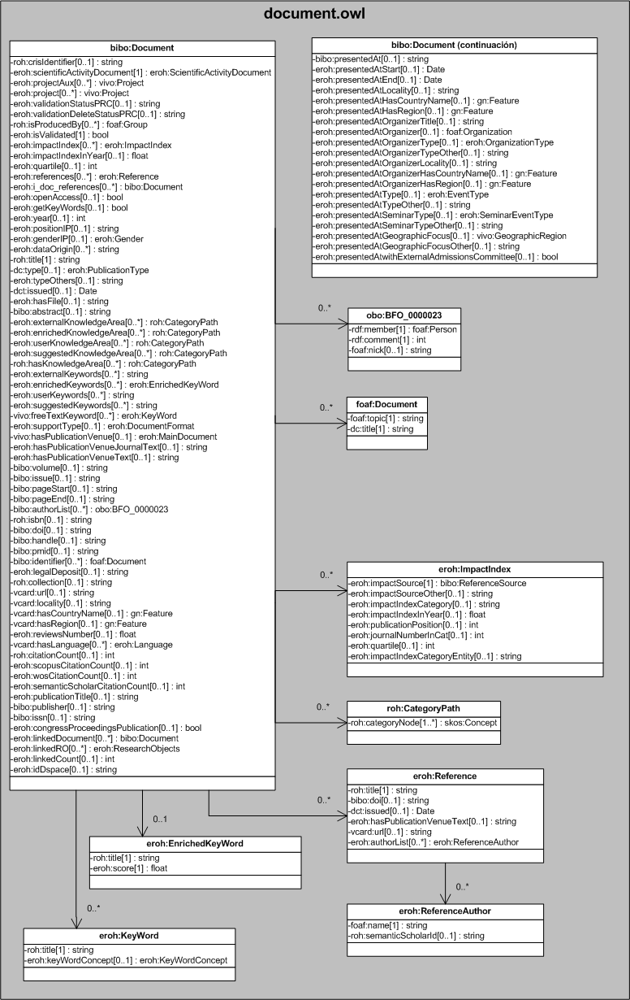

| Fecha         | 09/12/2021                                                   |
| ------------- | ------------------------------------------------------------ |
|Título|Objeto de Conocimiento Document| 
|Descripción|Descripción del objeto de conocimiento Document para Hércules|
|Versión|1.0|
|Módulo|Documentación|
|Tipo|Especificación|
|Cambios de la Versión|Versión inicial|

# Hércules ED. Objeto de conocimiento Document

La entidad bibo:Document (ver Figura 1) representa las publicaciones llevadas a cabo en el ámbito de la investigación.

- [eroh:ScientificActivityDocument](https://github.com/HerculesCRUE/Commons-ED-MA/tree/main/ObjetosDeConocimiento/ScientificActivityDocument), representa los documentos de actividad científica.
- [vivo:Project](https://github.com/HerculesCRUE/Commons-ED-MA/tree/main/ObjetosDeConocimiento/Project), representa un proyecto asociado.
- [foaf:Group](https://github.com/HerculesCRUE/Commons-ED-MA/tree/main/ObjetosDeConocimiento/Group), representa el grupo asociado.
- eroh:ImpactIndex, representa el indice de impacto del documento.
- eroh:Reference, representa las referencias a otros ítems.
- [bibo:Document](https://github.com/HerculesCRUE/Commons-ED-MA/tree/main/ObjetosDeConocimiento/Document), representa un documento asociado.
- [eroh:Gender](https://github.com/HerculesCRUE/Commons-ED-MA/tree/main/ObjetosDeConocimiento/Gender), representa el sexo del investigador principal.
- [eroh:PublicationType](https://github.com/HerculesCRUE/Commons-ED-MA/tree/main/ObjetosDeConocimiento/PublicationType), representa el tipo de material publicado.
- roh:CategoryPath, representa las diferentes áreas temáticas.
- eroh:EnrichedKeyWord, representa las palabras clave enriquecidas.
- eroh:KeyWord, representa los descriptores específicos y los descriptores específicos enriquecidos.
- [eroh:DocumentFormat](https://github.com/HerculesCRUE/Commons-ED-MA/tree/main/ObjetosDeConocimiento/DocumentFormat), representa el tipo de soporte en el que se ha plasmado.
- [eroh:MainDocument](https://github.com/HerculesCRUE/Commons-ED-MA/tree/main/ObjetosDeConocimiento/MainDocument), representa la revista.
- obo:BFO_0000023, representa el listado de autores del documento.
- foaf:Document, representa otros identificadores.
- [gn:Feature](https://github.com/HerculesCRUE/Commons-ED-MA/tree/main/ObjetosDeConocimiento/Feature), representa el país y la comunidad autónoma o región.
- [eroh:Language](https://github.com/HerculesCRUE/Commons-ED-MA/tree/main/ObjetosDeConocimiento/Language), representa el idioma de traducción.
- [eroh:ResearchObject](https://github.com/HerculesCRUE/Commons-ED-MA/tree/main/ObjetosDeConocimiento/Researchobject), representa un ResearchObject asociado.
- [foaf:Organization](https://github.com/HerculesCRUE/Commons-ED-MA/tree/main/ObjetosDeConocimiento/Organization), representa una entidad u organización asociada.
- [eroh:OrganizationType](https://github.com/HerculesCRUE/Commons-ED-MA/tree/main/ObjetosDeConocimiento/OrganizationType), representa el tipo de organización.
- [eroh:EventType](https://github.com/HerculesCRUE/Commons-ED-MA/tree/main/ObjetosDeConocimiento/EventType), representa el tipo de evento.
- [eroh:SeminarEventType](https://github.com/HerculesCRUE/Commons-ED-MA/tree/main/ObjetosDeConocimiento/SeminarEventType), representa el tipo de evento en el que se ha presentado el trabajo.
- [vivo:GeographicRegion](https://github.com/HerculesCRUE/Commons-ED-MA/tree/main/ObjetosDeConocimiento/GeographicRegion), representa el ámbito geográfico.

*Figura 1. Diagrama ontológico para la entidad bibo:Document*
