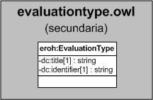

| Fecha         | 15/03/2022                                                   |
| ------------- | ------------------------------------------------------------ |
|Título|Objeto de Conocimiento EvaluationType| 
|Descripción|Descripción del objeto de conocimiento EvaluationType para Hércules|
|Versión|1.0|
|Módulo|Documentación|
|Tipo|Especificación|
|Cambios de la Versión|Versión inicial|

# Hércules ED. Objeto de conocimiento EvaluationType

La entidad eroh:EvaluationType (ver Figura 1) representa el tipo de evaluación en el Curriculum Vitae en la plataforma Hércules. Dispone de varias opciones:
- Encuesta
- Evaluación externa
- Evaluación interna
- Otros

*Figura 1. Diagrama ontológico para la entidad eroh:EvaluationType*
