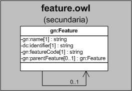

| Fecha         | 15/03/2022                                                   |
| ------------- | ------------------------------------------------------------ |
|Título|Objeto de Conocimiento Feature| 
|Descripción|Descripción del objeto de conocimiento Feature para Hércules|
|Versión|1.0|
|Módulo|Documentación|
|Tipo|Especificación|
|Cambios de la Versión|Versión inicial|

# Hércules ED. Objeto de conocimiento Feature

La entidad gn:Feature (ver Figura 1) representa el tipo de país de celebración, comunidad autónoma/región de celebración y ciudad de celebración en la plataforma Hércules.

Una instancia de gn:Feature se asocia con entidades a través de propiedades de objeto:

- gn:Feature, representa el ítem padre.

*Figura 1. Diagrama ontológico para la entidad gn:Feature*
