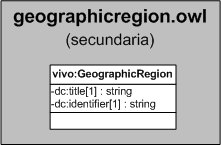

| Fecha         | 15/03/2022                                                   |
| ------------- | ------------------------------------------------------------ |
|Título|Objeto de Conocimiento GeographicRegion| 
|Descripción|Descripción del objeto de conocimiento GeographicRegion para Hércules|
|Versión|1.0|
|Módulo|Documentación|
|Tipo|Especificación|
|Cambios de la Versión|Versión inicial|

# Hércules ED. Objeto de conocimiento GeographicRegion

La entidad vivo:GeographicRegion (ver Figura 1) representa el tipo de ámbito del evento en el Curriculum Vitae en la plataforma Hércules. Dispone de varias opciones:
- Autonómica
- Nacional
- Unión Europea
- Internacional no UE
- Otros

A continuación se listan todas aquellas propiedades contenidas en vivo:GeographicRegion que extienden la ontología fundamental ROH con el fin de ajustarse a las necesidades de Hércules EDMA:

- dc:title
- dc:identifier

*Figura 1. Diagrama ontológico para la entidad eroh:GeographicRegion*
