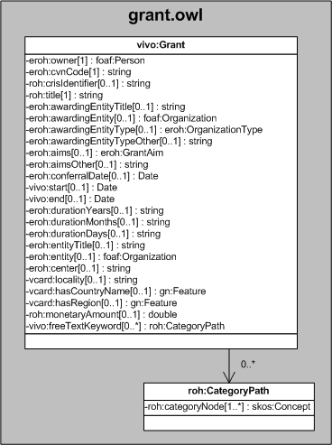

| Fecha         | 09/12/2021                                                   |
| ------------- | ------------------------------------------------------------ |
|Título|Objeto de Conocimiento Grant| 
|Descripción|Descripción del objeto de conocimiento Grant para Hércules|
|Versión|1.0|
|Módulo|Documentación|
|Tipo|Especificación|
|Cambios de la Versión|Versión inicial|

# Hércules ED. Objeto de conocimiento Grant

La entidad vivo:Grant (ver Figura 1) representa todas aquellas ayudas económicas y/o becas de titularidad pública o privada, nacionales e internacionales, de las que pueda ser beneficiario un investigador.
Se han añadido ciertas propiedades que extienden la ontología fundamental con el fin de dar respuesta a las necesidades de gestión de datos requeridas durante el desarrollo de la infraestructura Hércules EDMA.

Una instancia de vivo:Grant se asocia con las siguientes entidades a través de propiedades de objeto:

- [foaf:Person](https://github.com/HerculesCRUE/Commons-ED-MA/tree/main/ObjetosDeConocimiento/Person), representa la persona asociada a las ayudas y/o becas.
- [foaf:Organization](https://github.com/HerculesCRUE/Commons-ED-MA/tree/main/ObjetosDeConocimiento/Organization), que vincula la ayuda con la entidad concesionaria (eroh:awardingEntity) y la entidad donde el investigador ha cursado los estudios que han sido objeto de una ayuda económica y/o beca (eroh:entity).
- [eroh:OrganizationType](https://github.com/HerculesCRUE/Commons-ED-MA/tree/main/ObjetosDeConocimiento/OrganizationType), representa el tipo de entidad.
- [eroh:GrantAim](https://github.com/HerculesCRUE/Commons-ED-MA/tree/main/ObjetosDeConocimiento/GrantAim), que representa la finalidad de la ayuda económica y/o beca recibida.
- [gn:Feature](https://github.com/HerculesCRUE/Commons-ED-MA/tree/main/ObjetosDeConocimiento/Feature), representa el país y la comunidad autónoma o región.
- roh:CategoryPath, que representa mediante un esquema jerárquico el tesauro con las áreas temáticas descriptoras de la ayuda o beca concedida.

*Figura 1. Diagrama ontológico para la entidad vivo:Grant*
