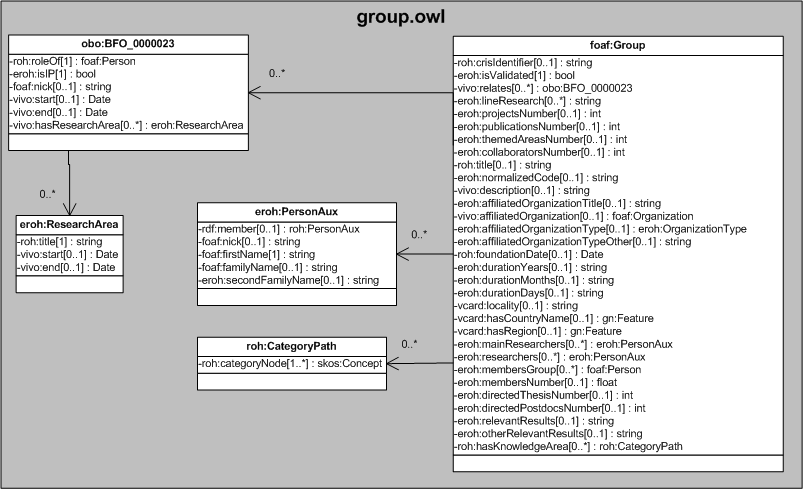

| Fecha         | 09/12/2021                                                   |
| ------------- | ------------------------------------------------------------ |
|Título|Objetos de Conocimiento Grupo| 
|Descripción|Descripción del objeto de conocimiento Grupo para Hércules|
|Versión|1.0|
|Módulo|Documentación|
|Tipo|Especificación|
|Cambios de la Versión|Versión inicial|

# Hércules ED. Objeto de conocimiento Grupo

La entidad foaf:Group (ver Figura 1) representa a un grupo de investigación. La especialización de dicha entidad incorpora algunas propiedades de los dominios de investigación, además de las correspondientes a la ontología fundamental empleada en ASIO.

Se han añadido ciertas propiedades que extienden la ontología fundamental con el fin de dar respuesta a las necesidades de gestión de datos requeridas durante el desarrollo de la infraestructura Hércules EDMA.

Las propiedades son las siguientes:

- roh:crisIdentifier
- eroh:isValidated
- vivo:relates
- eroh:lineResearch
- eroh:projectsNumber
- eroh:publicationsNumber
- eroh:themedAreasNumber
- eroh:collaboratorsNumber
- roh:title
- eroh:normalizedCode
- vivo:description
- eroh:affiliatedOrganizationTitle
- eroh:affiliatedOrganization
- eroh:affiliatedOrganizationType
- eroh:affiliatedOrganizationTypeOther
- roh:foundationDate
- eroh:durationYear
- eroh:durationMonth
- eroh:durationDays
- vcard:locality
- vcard:hasCountryName
- vcard:hasRegion
- eroh:mainRegion
- eroh:researchers 
- eroh:membersGroup 
- eroh:membersNumber 
- eroh:directedThesisNumber 
- eroh:directedPostdocsNumber
- eroh:relevantResults
- eroh:otherRelevantResults
- roh:hasKnowledgeArea

En ROH, foaf:Group está basada en FOAF (Friend of a Friend) y sigue los patrones empleados en VIVO. Ello explica la inclusión de propiedades como foaf:member, vivo:affiliatedOrganization o vivo:description. Se han adoptado otras relaciones de importancia acordes al formato común de información en materia de la investigación europea (CERIF), como roh:crisIdentifier o roh:title.

Una instancia de foaf:Group se asocia con las siguientes entidades a través de propiedades de objeto:
- foaf:Organization, que vincula a un grupo de investigación con una determinada organización.
- eroh:ColaborationTypeGroup, que representa el tipo de colaboración llevada a cabo por un grupo de investigación.
- obo:BFO_0000023, que contiene información sobre la actividad del investigador en el grupo (fechas de comienzo y fin de su participación, su firma, la persona a la que apunta,
- eroh:GroupClassification, que vincula al grupo de investigación con las áreas temáticas.

*Figura 1. Diagrama ontológico para la entidad foaf:Group*
