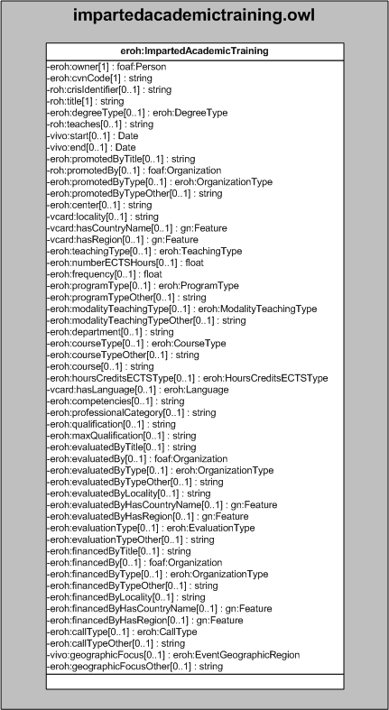

| Fecha         | 15/03/2022                                                   |
| ------------- | ------------------------------------------------------------ |
|Título|Objeto de Conocimiento ImpartedAcademicTraining| 
|Descripción|Descripción del objeto de conocimiento ImpartedAcademicTraining para Hércules|
|Versión|1.0|
|Módulo|Documentación|
|Tipo|Especificación|
|Cambios de la Versión|Versión inicial|

# Hércules ED. Objeto de conocimiento ImpartedAcademicTraining

La entidad eroh:ImpartedAcademicTraining (ver Figura 1) representa la Formación académica impartida en el Curriculum Vitae en la plataforma Hércules.

Una instancia de eroh:ImpartedAcademicTraining se asocia, a su vez, con las siguientes entidades a través de propiedades de objeto:

- [foaf:Person](https://github.com/HerculesCRUE/Commons-ED-MA/tree/main/ObjetosDeConocimiento/Person), representa la persona asociada a la formación.
- [eroh:DegreeType](https://github.com/HerculesCRUE/Commons-ED-MA/tree/main/ObjetosDeConocimiento/DegreeType), representa la titulación universitaria.
- [foaf:Organization](https://github.com/HerculesCRUE/Commons-ED-MA/tree/main/ObjetosDeConocimiento/Organization), representa las entidades.
- [eroh:OrganizationType](https://github.com/HerculesCRUE/Commons-ED-MA/tree/main/ObjetosDeConocimiento/OrganizationType), representa el tipo de entidad.
- [gn:Feature](https://github.com/HerculesCRUE/Commons-ED-MA/tree/main/ObjetosDeConocimiento/Feature), representa el país y la comunidad autónoma o región.
- [eroh:TeachingType](https://github.com/HerculesCRUE/Commons-ED-MA/tree/main/ObjetosDeConocimiento/TeachingType), representa el tipo de docencia.
- [eroh:ProgramType](https://github.com/HerculesCRUE/Commons-ED-MA/tree/main/ObjetosDeConocimiento/ProgramType), representa el tipo de programa.
- [eroh:ModalityTeachingType](https://github.com/HerculesCRUE/Commons-ED-MA/tree/main/ObjetosDeConocimiento/ModalityTeachingType), representa el tipo de modalidad de docencia.
- [eroh:CourseType](https://github.com/HerculesCRUE/Commons-ED-MA/tree/main/ObjetosDeConocimiento/CourseType), representa el tipo de asignatura.
- [eroh:HoursCreditsECTSType](https://github.com/HerculesCRUE/Commons-ED-MA/tree/main/ObjetosDeConocimiento/HoursCreditsECTSType), representa el tipo de horas/creditos ECTS.
- [eroh:Language](https://github.com/HerculesCRUE/Commons-ED-MA/tree/main/ObjetosDeConocimiento/Language), representa el idioma de la asignatura.
- [eroh:EvaluationType](https://github.com/HerculesCRUE/Commons-ED-MA/tree/main/ObjetosDeConocimiento/EvaluationType), representa el tipo de evaluación.
- [eroh:CallType](https://github.com/HerculesCRUE/Commons-ED-MA/tree/main/ObjetosDeConocimiento/CallType), representa el tipo de convocatoria.
- [eroh:EventGeographicRegion](https://github.com/HerculesCRUE/Commons-ED-MA/tree/main/ObjetosDeConocimiento/EventGeographicRegion), representa el ámbito geográfico.

*Figura 1. Diagrama ontológico para la entidad eroh:ImpartedAcademicTraining*
