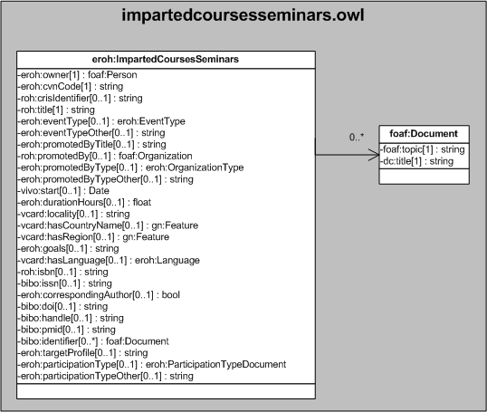

| Fecha         | 15/03/2022                                                   |
| ------------- | ------------------------------------------------------------ |
|Título|Objeto de Conocimiento ImpartedCoursesSeminars| 
|Descripción|Descripción del objeto de conocimiento ImpartedCoursesSeminars para Hércules|
|Versión|1.0|
|Módulo|Documentación|
|Tipo|Especificación|
|Cambios de la Versión|Versión inicial|

# Hércules ED. Objeto de conocimiento ImpartedCoursesSeminars

La entidad eroh:ImpartedCoursesSeminars (ver Figura 1) representa los Cursos y seminarios impartidos orientados a la formación docente universitaria en el Curriculum Vitae en la plataforma Hércules.

A continuación se listan todas aquellas propiedades contenidas en eroh:ImpartedCoursesSeminars que extienden la ontología fundamental ROH con el fin de ajustarse a las necesidades de Hércules EDMA:

- eroh:owner
- eroh:cvnCode
- roh:crisIdentifier
- roh:title
- eroh:eventType
- eroh:eventTypeOther
- eroh:promotedByTitle
- roh:promotedBy
- eroh:promotedByType
- eroh:promotedByTypeOther
- vivo:start
- eroh:durationHours
- vcard:locality
- vcard:hasCountryName
- vcard:hasRegion
- eroh:goals
- vcard:hasLanguage
- roh:isbn
- bibo:issn
- eroh:correspondingAuthor
- bibo:doi
- bibo:handle
- bibo:pmid
- bibo:identifier
- eroh:targetProfile
- eroh:participationType
- eroh:participationTypeOther

*Figura 1. Diagrama ontológico para la entidad eroh:ImpartedCoursesSeminars*
