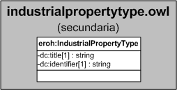

| Fecha         | 15/03/2022                                                   |
| ------------- | ------------------------------------------------------------ |
|Título|Objeto de Conocimiento IndustrialPropertyType| 
|Descripción|Descripción del objeto de conocimiento IndustrialPropertyType para Hércules|
|Versión|1.0|
|Módulo|Documentación|
|Tipo|Especificación|
|Cambios de la Versión|Versión inicial|

# Hércules ED. Objeto de conocimiento IndustrialPropertyType

La entidad eroh:IndustrialPropertyType (ver Figura 1) representa el tipo de la propiedad industrial en el Curriculum Vitae en la plataforma Hércules. Dispone de varias opciones:
- Diseños industriales
- Marcas
- Modelo de utilidad
- Patente de inversión
- Variedades vegetales
- Otros

*Figura 1. Diagrama ontológico para la entidad eroh:IndustrialPropertyType*
