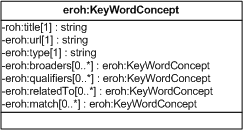

| Fecha         | 15/03/2022                                                   |
| ------------- | ------------------------------------------------------------ |
|Título|Objeto de Conocimiento KeyWordConcept| 
|Descripción|Descripción del objeto de conocimiento KeyWordConcept para Hércules|
|Versión|1.0|
|Módulo|Documentación|
|Tipo|Especificación|
|Cambios de la Versión|Versión inicial|

# Hércules ED. Objeto de conocimiento KeyWordConcept

La entidad eroh:KeyWordConcept (ver Figura 1) representa las palabras clave en el Curriculum Vitae en la plataforma Hércules.

Una instancia de eroh:KeyWordConcept se asocia, a su vez, con las siguientes entidades a través de propiedades de objeto:

- eroh:KeyWordConcept, representa la relación que hay entre palabras clave.

*Figura 1. Diagrama ontológico para la entidad eroh:KeyWordConcept*
