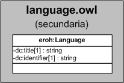

| Fecha         | 15/03/2022                                                   |
| ------------- | ------------------------------------------------------------ |
|Título|Objeto de Conocimiento Language| 
|Descripción|Descripción del objeto de conocimiento Language para Hércules|
|Versión|1.0|
|Módulo|Documentación|
|Tipo|Especificación|
|Cambios de la Versión|Versión inicial|

# Hércules ED. Objeto de conocimiento Language

La entidad eroh:Language (ver Figura 1) representa el tipo de traducciones a otras lenguas en el Curriculum Vitae en la plataforma Hércules.

*Figura 1. Diagrama ontológico para la entidad eroh:Language*
