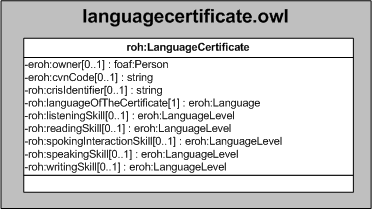

| Fecha         | 15/03/2022                                                   |
| ------------- | ------------------------------------------------------------ |
|Título|Objeto de Conocimiento LanguageCertificate| 
|Descripción|Descripción del objeto de conocimiento LanguageCertificate para Hércules|
|Versión|1.0|
|Módulo|Documentación|
|Tipo|Especificación|
|Cambios de la Versión|Versión inicial|

# Hércules ED. Objeto de conocimiento LanguageCertificate

La entidad roh:LanguageCertificate (ver Figura 1) representa un ítem de conocimiento de idiomas.

Las propiedades son las siguientes:

- eroh:owner
- eroh:cvnCode
- roh:crisIdentifier
- roh:languageOfTheCertificate
- roh:listeningSkill
- roh:readingSkill
- roh:spokingInteractionSkill
- roh:speakingSkill
- roh:writingSkill

*Figura 1. Diagrama ontológico para la entidad eroh:LanguageCertificate*
