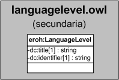

| Fecha         | 15/03/2022                                                   |
| ------------- | ------------------------------------------------------------ |
|Título|Objeto de Conocimiento LanguageLevel| 
|Descripción|Descripción del objeto de conocimiento LanguageLevel para Hércules|
|Versión|1.0|
|Módulo|Documentación|
|Tipo|Especificación|
|Cambios de la Versión|Versión inicial|

# Hércules ED. Objeto de conocimiento LanguageLevel

La entidad eroh:LanguageLevel (ver Figura 1) representa el tipo de compresión auditiva en el Curriculum Vitae en la plataforma Hércules. Dispone de varias opciones:
- A1
- A2
- B1
- B2
- C1
- C2

*Figura 1. Diagrama ontológico para la entidad eroh:LanguageLevel*
