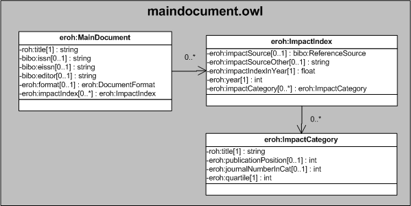

| Fecha         | 10/12/2021                                                   |
| ------------- | ------------------------------------------------------------ |
|Título|Objeto de Conocimiento Publicación Principal| 
|Descripción|Descripción del objeto de conocimiento Publicación Principal para Hércules|
|Versión|1.0|
|Módulo|Documentación|
|Tipo|Especificación|
|Cambios de la Versión|Versión inicial|

# Hércules ED. Objeto de conocimiento Publicación Principal

La entidad eroh:MainDocument (ver Figura 1) representa las publicaciones principales, como revistas o libros, en las que se ha publicado cualquier trabajo de investigación.
Se han añadido dos propiedades que extienden la ontología fundamental con el fin de dar respuesta a las necesidades de gestión de datos requeridas durante el desarrollo de la infraestructura.

Las propiedades extendidas son las siguientes:

- eroh:format
- eroh:impactIndex

Una instancia de eroh:MainDocument se asocia, a su vez, con las siguientes entidades a través de propiedades de objeto:

- eroh:DocumentFormat, que establece el tipo de soporte de la publicación principal (catálogo de obra artística, documento o informe científico-técnico, libro o revista).
- eroh:ImpactIndex, que informa sobre los diferentes índices de impacto de la publicación principal en función del año.

A su vez, la entidad auxiliar eroh:ImpactIndex se relaciona con estas otras dos entidades secundarias a través de propiedades de objeto:

- eroh:ImpactIndexCategory --> Informa sobre la categoría en la que se enmarca el índice de impacto.
- bibo:ReferenceSource --> Contiene la fuente consultada para la obtención del índice de impacto.

*Figura 1. Diagrama ontológico para la entidad eroh:MainDocument*
