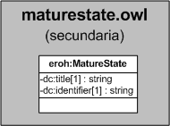

| Fecha         | 15/03/2022                                                   |
| ------------- | ------------------------------------------------------------ |
|Título|Objeto de Conocimiento MatureState| 
|Descripción|Descripción del objeto de conocimiento MatureState para Hércules|
|Versión|1.0|
|Módulo|Documentación|
|Tipo|Especificación|
|Cambios de la Versión|Versión inicial|

# Hércules ED. Objeto de conocimiento MatureState

La entidad eroh:MatureState (ver Figura 1) representa el estado de madurez de la oferta tecnológica ofrecida por una universidad. 

Los valores posibles son los correspondientes al estándar TRL

A continuación se listan todas aquellas propiedades contenidas en eroh:MatureState que extienden la ontología fundamental ROH con el fin de ajustarse a las necesidades de Hércules EDMA:

- dc:title
- dc:identifier

*Figura 1. Diagrama ontológico para la entidad eroh:MatureState*
