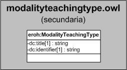

| Fecha         | 15/03/2022                                                   |
| ------------- | ------------------------------------------------------------ |
|Título|Objeto de Conocimiento ModalityTeachingType| 
|Descripción|Descripción del objeto de conocimiento ModalityTeachingType para Hércules|
|Versión|1.0|
|Módulo|Documentación|
|Tipo|Especificación|
|Cambios de la Versión|Versión inicial|

# Hércules ED. Objeto de conocimiento ModalityTeachingType

La entidad eroh:ModalityTeachingType (ver Figura 1) representa el tipo de docencia en el Curriculum Vitae en la plataforma Hércules. Dispone de varias opciones:
- Clínico
- Prácticas de laboratorio
- Práctica (Aula-Problemas)
- Teórica presencial
- Virtual
- Otros

*Figura 1. Diagrama ontológico para la entidad eroh:ModalityTeachingType*
