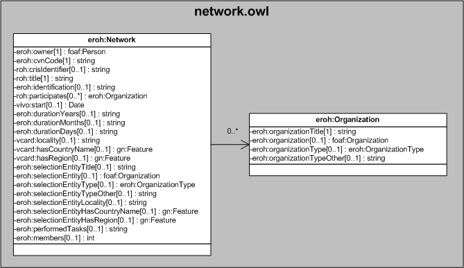

| Fecha         | 10/12/2021                                                   |
| ------------- | ------------------------------------------------------------ |
|Título|Objeto de Conocimiento Network| 
|Descripción|Descripción del objeto de conocimiento Network para Hércules|
|Versión|1.0|
|Módulo|Documentación|
|Tipo|Especificación|
|Cambios de la Versión|Versión inicial|

# Hércules ED. Objeto de conocimiento Network

La entidad eroh:Network (ver Figura 1) representa las distintas redes de cooperación nacional, regional e internacional, constituidas por entidades públicas o privadas: redes académicas, de investigación, temáticas, interdisciplinares, de innovación, institucionales, interinstitucionales, etc., que tengan relevancia en el ámbito científico.

Una instancia de eroh:Network se asocia, a su vez, con las siguientes entidades a través de propiedades de objeto:

- [foaf:Person](https://github.com/HerculesCRUE/Commons-ED-MA/tree/main/ObjetosDeConocimiento/Person), representa  la persona asociada a la red de cooperación. 
- eroh:Organization, representa las entidades participantes. 
- [foaf:Organization](https://github.com/HerculesCRUE/Commons-ED-MA/tree/main/ObjetosDeConocimiento/Organization), que referencia las distintas organizaciones que forman parte de la red de cooperación.
- gn:Feature, que vincula la red de cooperación con el país (vcard:hasCountryName) y la región (vcard:hasRegion) de radicación.

*Figura 1. Diagrama ontológico para la entidad eroh:Network*
