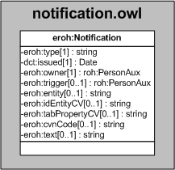

| Fecha         | 15/03/2022                                                   |
| ------------- | ------------------------------------------------------------ |
|Título|Objeto de Conocimiento Notification| 
|Descripción|Descripción del objeto de conocimiento Notification para Hércules|
|Versión|1.0|
|Módulo|Documentación|
|Tipo|Especificación|
|Cambios de la Versión|Versión inicial|

# Hércules ED. Objeto de conocimiento Notification

La entidad eroh:Notification (ver Figura 1) representa una notificación en la plataforma Hércules.

A continuación se listan todas aquellas propiedades contenidas en eroh:Notification que extienden la ontología fundamental ROH con el fin de ajustarse a las necesidades de Hércules EDMA:

- eroh:type
- dct:issued
- eroh:owner
- eroh:trigger
- eroh:entity
- eroh:idEntityCV
- eroh:tabPropertyCV
- eroh:cvnCode
- eroh:text

*Figura 1. Diagrama ontológico para la entidad eroh:Notification*
