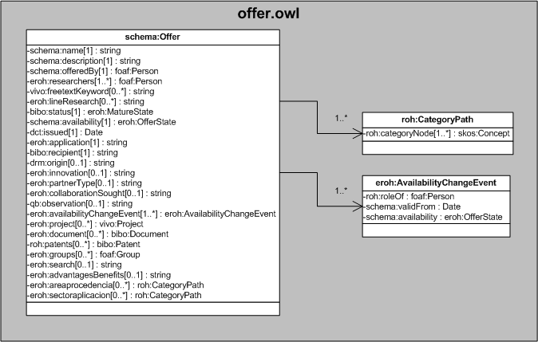

| Fecha         | 15/03/2022                                                   |
| ------------- | ------------------------------------------------------------ |
|Título|Objeto de Conocimiento Offer| 
|Descripción|Descripción del objeto de conocimiento Offer para Hércules|
|Versión|1.0|
|Módulo|Documentación|
|Tipo|Especificación|
|Cambios de la Versión|Versión inicial|

# Hércules ED. Objeto de conocimiento Offer

La entidad eroh:Offer (ver Figura 1) representa una oferta tecnológicas en la plataforma Hércules.

Una instancia de eroh:Offer se asocia, a su vez, con las siguientes entidades a través de propiedades de objeto:

- [foaf:Person](https://github.com/HerculesCRUE/Commons-ED-MA/tree/main/ObjetosDeConocimiento/Person), representa la persona asociada a la oferta.
- [eroh:MatureState](https://github.com/HerculesCRUE/Commons-ED-MA/tree/main/ObjetosDeConocimiento/MatureState), representa el estado de madurez.
- [eroh:OfferState](https://github.com/HerculesCRUE/Commons-ED-MA/tree/main/ObjetosDeConocimiento/OfferState), representa el estado de la oferta.
- eroh:AvailabilityChangeEvent, representa un evento de cambio en el estado de la oferta, realizado por una persona.
- [vivo:Project](https://github.com/HerculesCRUE/Commons-ED-MA/tree/main/ObjetosDeConocimiento/Project), representa los proyectos asociados a la oferta.
- [bibo:Document](https://github.com/HerculesCRUE/Commons-ED-MA/tree/main/ObjetosDeConocimiento/Document), representa los documentos asociados a la oferta.
- [bibo:Patent](https://github.com/HerculesCRUE/Commons-ED-MA/tree/main/ObjetosDeConocimiento/Patent), representa los ítems de propiedad industrial e intelectual asociados al ítem.
- [foaf:Group](https://github.com/HerculesCRUE/Commons-ED-MA/tree/main/ObjetosDeConocimiento/Group), representa los grupos asociados a una oferta.
- roh:CategoryPath, representa las áreas de procedencia y los sectores de aplicación de una oferta.

*Figura 1. Diagrama ontológico para la entidad eroh:Offer*
