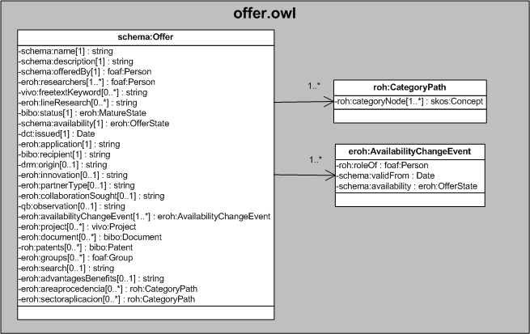

| Fecha         | 15/03/2022                                                   |
| ------------- | ------------------------------------------------------------ |
|Título|Objeto de Conocimiento Offer| 
|Descripción|Descripción del objeto de conocimiento Offer para Hércules|
|Versión|1.0|
|Módulo|Documentación|
|Tipo|Especificación|
|Cambios de la Versión|Versión inicial|

# Hércules ED. Objeto de conocimiento Offer

La entidad eroh:Offer (ver Figura 1) representa una oferta tecnológicas en la plataforma Hércules.

A continuación se listan todas aquellas propiedades contenidas en eroh:Offer que extienden la ontología fundamental ROH con el fin de ajustarse a las necesidades de Hércules EDMA:

- schema:name
- schema:description
- schema:offeredBy
- eroh:researchers
- vivo:freetextKeyword
- eroh:lineResearch
- bibo:status
- eroh:framingSector
- schema:availability
- dct:issued
- eroh:application
- bibo:recipient
- drm:origin
- eroh:innovation
- eroh:partnerType
- eroh:collaborationSought
- qb:observation
- eroh:availabilityChangeEvent
- eroh:project
- eroh:document
- roh:patents
- schema:color

*Figura 1. Diagrama ontológico para la entidad eroh:Offer*
