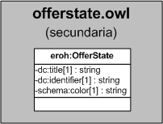

| Fecha         | 15/03/2022                                                   |
| ------------- | ------------------------------------------------------------ |
|Título|Objeto de Conocimiento OfferState| 
|Descripción|Descripción del objeto de conocimiento OfferState para Hércules|
|Versión|1.0|
|Módulo|Documentación|
|Tipo|Especificación|
|Cambios de la Versión|Versión inicial|

# Hércules ED. Objeto de conocimiento OfferState

La entidad eroh:OfferState (ver Figura 1) representa el estado de la oferta para una oferta tecnológica ofrecida por una universidad.

Dispone de varias opciones:
- En Borrador
- En Revisión
- Validada
- Denegada
- Archivada

*Figura 1. Diagrama ontológico para la entidad eroh:OfferState*
