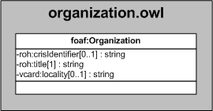

| Fecha         | 10/12/2021                                                   |
| ------------- | ------------------------------------------------------------ |
|Título|Objeto de Conocimiento Organización| 
|Descripción|Descripción del objeto de conocimiento Organización para Hércules|
|Versión|1.0|
|Módulo|Documentación|
|Tipo|Especificación|
|Cambios de la Versión|Versión inicial|

# Hércules ED. Objeto de conocimiento Organización

La entidad foaf:Organization (ver Figura 1) representa cualquier tipo de organización dentro de la plataforma Hércules.
Se han añadido dos propiedades que extienden la ontología fundamental con el fin de dar respuesta a las necesidades de gestión de datos requeridas durante el desarrollo de la infraestructura.

Las propiedades extendidas son las siguientes:
- eroh:otherTypeMoreInfo
- eroh:isSynchronized

Una instancia de foaf:Organization se asocia con las siguientes entidades a través de propiedades de objeto:

- eroh:OrganizationType, que estable el tipo de organización.
- gn:Feature, que vincula la organización con el país (vcard:hasCountryName) y la región (vcard:hasRegion) de radicación.

*Figura 1. Diagrama ontológico para la entidad foaf:Organization*
