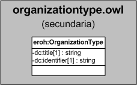

| Fecha         | 15/03/2022                                                   |
| ------------- | ------------------------------------------------------------ |
|Título|Objeto de Conocimiento OrganizationType| 
|Descripción|Descripción del objeto de conocimiento OrganizationType para Hércules|
|Versión|1.0|
|Módulo|Documentación|
|Tipo|Especificación|
|Cambios de la Versión|Versión inicial|

# Hércules ED. Objeto de conocimiento OrganizationType

La entidad eroh:OrganizationType (ver Figura 1) representa el tipo de entidad en el Curriculum Vitae en la plataforma Hércules. Dispone de varias opciones:
- Universidad
- Instituto Universitario de investigación
- Centros y Estructuras Universitarios y Asimilados
- Departamento Universitario
- Fundación
- Agencia Estatal
- Organismo Público de Investigación
- Organismo, Otros
- Entidad Empresarial
- Entidad Gestora del Sistema Nacional de Salud
- Instituciones Sanitarias
- Centro Tecnológico
- Centro de I+D
- Asociaciones y Agrupaciones
- CIBER
- Centros de Innovacion y Tecnología
- Organismo, Otros

A continuación se listan todas aquellas propiedades contenidas en eroh:OrganizationType que extienden la ontología fundamental ROH con el fin de ajustarse a las necesidades de Hércules EDMA:

- dc:title
- dc:identifier

*Figura 1. Diagrama ontológico para la entidad eroh:OrganizationType*
