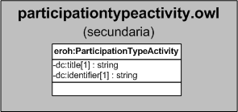

| Fecha         | 15/03/2022                                                   |
| ------------- | ------------------------------------------------------------ |
|Título|Objeto de Conocimiento ParticipationTypeActivity| 
|Descripción|Descripción del objeto de conocimiento ParticipationTypeActivity para Hércules|
|Versión|1.0|
|Módulo|Documentación|
|Tipo|Especificación|
|Cambios de la Versión|Versión inicial|

# Hércules ED. Objeto de conocimiento ParticipationTypeActivity

La entidad eroh:ParticipationTypeActivity (ver Figura 1) representa el tipo de modo de participación en el Curriculum Vitae en la plataforma Hércules. Dispone de varias opciones:
- Comisario/a de exposición
- Organizador
- Presidente
- Secretario/a
- Otros

*Figura 1. Diagrama ontológico para la entidad eroh:ParticipationTypeActivity*
