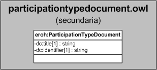

| Fecha         | 15/03/2022                                                   |
| ------------- | ------------------------------------------------------------ |
|Título|Objeto de Conocimiento ParticipationTypeDocument| 
|Descripción|Descripción del objeto de conocimiento ParticipationTypeDocument para Hércules|
|Versión|1.0|
|Módulo|Documentación|
|Tipo|Especificación|
|Cambios de la Versión|Versión inicial|

# Hércules ED. Objeto de conocimiento ParticipationTypeDocument

La entidad eroh:ParticipationTypeDocument (ver Figura 1) representa el tipo de participación en el Curriculum Vitae en la plataforma Hércules. Dispone de varias opciones:
- Organizativo - Presidente Comité
- Organizativo - Comité científico y organizador
- Organizativo - Otros
- Participativo - Plenaria 
- Participativo - Ponencia invitada/Keynote
- Participativo - Ponencia oral (comunicación oral)
- Participativo - Póster
- Participativo - Otros

A continuación se listan todas aquellas propiedades contenidas en eroh:ParticipationTypeDocument que extienden la ontología fundamental ROH con el fin de ajustarse a las necesidades de Hércules EDMA:

- dc:title
- dc:identifier

*Figura 1. Diagrama ontológico para la entidad eroh:ParticipationTypeDocument*
