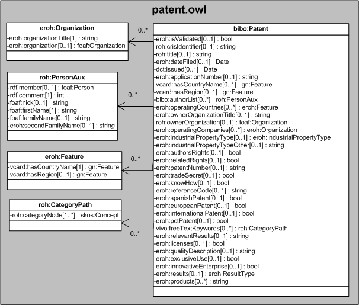

| Fecha         | 10/12/2021                                                   |
| ------------- | ------------------------------------------------------------ |
|Título|Objeto de Conocimiento Patente| 
|Descripción|Descripción del objeto de conocimiento Patente para Hércules|
|Versión|1.0|
|Módulo|Documentación|
|Tipo|Especificación|
|Cambios de la Versión|Versión inicial|

# Hércules ED. Objeto de conocimiento Patente

La entidad bibo:Patent (ver Figura 1) representa tanto los derechos de propiedad industrial (marcas, patentes, diseño industrial, modelos de utilidad, variedades vegetales, denominaciones de origen) como los derechos de derechos de autor (derechos morales y de explotación)
Se han añadido varias propiedades que extienden la ontología fundamental con el fin de dar respuesta a las necesidades de gestión de datos requeridas durante el desarrollo de la infraestructura.

Las propiedades extendidas son las siguientes:

- eroh:isValidated
- roh:crisIdentifier
- roh:title
- eroh:dateField
- dct:issued
- eroh:applicationNumber
- vcard:hasCountryName
- vcard:hasRegion
- bibo:authorList
- eroh:operatingCountries
- eroh:ownerOrganizationTitle
- roh:ownerOrganization
- eroh:operatingCompanies
- eroh:industrialPropertyType
- eroh:industrialPropertyTypeOther
- eroh:authorsRights
- eroh:relatedRights
- eroh:patentNumber
- eroh:tradeSecret
- eroh:knowHow
- eroh:referenceCode
- eroh:spanishPatent
- eroh:europeanPatent
- eroh:internationalPatent
- eroh:pctPatent
- vivo:freeTextKeywords
- eroh:relevantResults
- eroh:licenses
- eroh:qualityDescription
- eroh:exclusiveUse
- eroh:innovativeEnterprise
- eroh:results
- eroh:products

Una instancia de bibo:Patent se asocia, a su vez, con las siguientes entidades a través de propiedades de objeto:

- roh:PersonAux, que referencia los autores de la propiedad intelectual.
- [eroh:Feature](https://github.com/HerculesCRUE/Commons-ED-MA/tree/main/ObjetosDeConocimiento/Feature), que referencia los paises sobre los cuales se ha extendido/formalizado la explotación.
- eroh:Organization, que referencia las empresas.
- [eroh:IndustrialPropertyType](https://github.com/HerculesCRUE/Commons-ED-MA/tree/main/ObjetosDeConocimiento/IndustrialPropertyType), que referencia el tipo de propiedad intelectual.
- [eroh:ResultType](https://github.com/HerculesCRUE/Commons-ED-MA/tree/main/ObjetosDeConocimiento/ResultType), que referencia el resultado.

*Figura 1. Diagrama ontológico para la entidad bibo:Patent*
