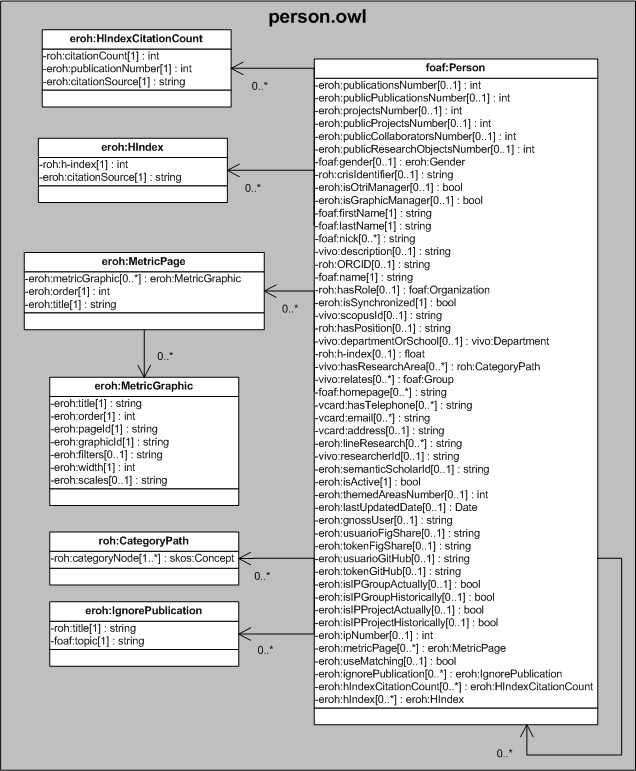

| Fecha         | 02/12/2021                                                   |
| ------------- | ------------------------------------------------------------ |
|Título|Objeto de Conocimiento Person| 
|Descripción|Descripción del objeto de conocimiento Person para Hércules|
|Versión|1.0|
|Módulo|Documentación|
|Tipo|Especificación|
|Cambios de la Versión|Versión inicial|

# Hércules ED. Objeto de conocimiento Person

La entidad foaf:Persona (ver Figura 1) representa a todas aquellas personas, externas o afiliadas a la Universidad de Murcia, que tienen cabida en la plataforma Hércules. La especialización de dicha entidad incorpora algunas propiedades de los dominios de investigación, además de las correspondientes a la ontología fundamental empleada en ASIO.
Por otra parte, se han añadido ciertas propiedades que extienden la ontología fundamental con el fin de dar respuesta a las necesidades de gestión de datos requeridas durante el desarrollo de la infraestructura Hércules EDMA.

En ROH, foaf:Person está basada en FOAF (Friend of a Friend) y sigue los patrones empleados en VIVO. Ello explica la inclusión de ciertas propiedades FOAF básicas como foaf:firstName, foaf:lastName, foaf:nick, foaf:name y foaf:homepage. Se han adoptado otras relaciones de importancia acordes al formato común de información en materia de la investigación europea (CERIF), como roh:crisIdentifier, roh:hasRole, roh:h-index o roh:ORCID.

Una instancia de foaf:Person se asocia con las siguientes entidades a través de propiedades de objeto:

- [eroh:Gender](https://github.com/HerculesCRUE/Commons-ED-MA/tree/main/ObjetosDeConocimiento/Gender), representa el sexo de la persona.
- [foaf:Organization](https://github.com/HerculesCRUE/Commons-ED-MA/tree/main/ObjetosDeConocimiento/Organization), que vincula a un investigador con una determinada organización.
- [vivo:Department](https://github.com/HerculesCRUE/Commons-ED-MA/tree/main/ObjetosDeConocimiento/Department), que vincula a un investigador con un departamento o escuela universitaria concreta.
- roh:CategoryPath, que vincula las áreas temáticas en las que un investigador desarrolla su trabajo.
- [foaf:Group](https://github.com/HerculesCRUE/Commons-ED-MA/tree/main/ObjetosDeConocimiento/Group), que vincula al investigador con uno o varios grupos de investigación.
- eroh:MetricPage, que vincula al investigador con las graficas de indicadores personales.
- eroh:IgnorePublication, que vincula la persona con las publicaciones que no quiere que se vuelvan a insertar en el CV.
- eroh:HIndexCitationCount, representa el número de citas del índice H.
- eroh:HIndex, representa el índice H.

*Figura 1. Diagrama ontológico para la entidad foaf:Person*
