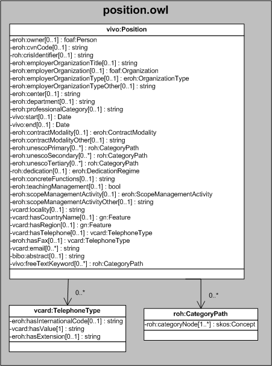

| Fecha         | 15/03/2022                                                   |
| ------------- | ------------------------------------------------------------ |
|Título|Objeto de Conocimiento Position| 
|Descripción|Descripción del objeto de conocimiento Position para Hércules|
|Versión|1.0|
|Módulo|Documentación|
|Tipo|Especificación|
|Cambios de la Versión|Versión inicial|

# Hércules ED. Objeto de conocimiento Position

La entidad vivo:Position (ver Figura 1) representa ítems de situación profesional actual e ítems de cargos actividades.

Las propiedades son las siguientes:

- eroh:owner
- eroh:cvnCode
- roh:crisIdentifier
- eroh:employerOrganizationTitle
- eroh:employerOrganization
- eroh:employerOrganizationType
- eroh:employerOrganizationTypeOther
- eroh:center
- eroh:department
- eroh:professionalCategory
- vivo:start
- vivo:end
- eroh:contractModality
- eroh:contractModalityOther
- eroh:unescoPrimary
- eroh:unescoSecondary
- eroh:unescoTertiary
- roh:dedecation
- eroh:concreteFunctions
- eroh:teachingManagement
- eroh:scopeManagementActivity
- eroh:scopeManagementActivityOther
- vcard:locality
- vcard:hasCountryName
- vcard:hasRegion
- vcard:hasTelephone
- eroh:hasFax
- vcard:email
- bibo:abstract
- vivo:freeTextKeyword

Una instancia de vivo:Position se asocia, a su vez, con las siguientes entidades a través de propiedades de objeto:

- vcard:TelephoneType, que referencia el teléfono y fax.
- roh:CategoryPath, que referencia los códigos UNESCO.
- eroh:ContractModality, que referencia la modalidad de contrato.
- eroh:DedicationRegime, que referencia los régimenes de dedicación.
- eroh:ScopeManagementActivity, que referencia el ámbito de actividad de gestión.

*Figura 1. Diagrama ontológico para la entidad eroh:Position*
