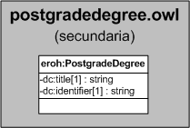

| Fecha         | 15/03/2022                                                   |
| ------------- | ------------------------------------------------------------ |
|Título|Objeto de Conocimiento PostgradeDegree| 
|Descripción|Descripción del objeto de conocimiento PostgradeDegree para Hércules|
|Versión|1.0|
|Módulo|Documentación|
|Tipo|Especificación|
|Cambios de la Versión|Versión inicial|

# Hércules ED. Objeto de conocimiento PostgradeDegree

La entidad eroh:PostgradeDegree (ver Figura 1) representa el nombre de titulación de posgrado en el Curriculum Vitae en la plataforma Hércules. 

*Figura 1. Diagrama ontológico para la entidad eroh:PostgradeDegree*
