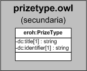

| Fecha         | 15/03/2022                                                   |
| ------------- | ------------------------------------------------------------ |
|Título|Objeto de Conocimiento PrizeType| 
|Descripción|Descripción del objeto de conocimiento PrizeType para Hércules|
|Versión|1.0|
|Módulo|Documentación|
|Tipo|Especificación|
|Cambios de la Versión|Versión inicial|

# Hércules ED. Objeto de conocimiento PrizeType

La entidad eroh:PrizeType (ver Figura 1) representa el tipo de premio en el Curriculum Vitae en la plataforma Hércules. Dispone de varias opciones:
- Premio extraordinario de licenciatura
- Premio fin de carrera
- Otros

*Figura 1. Diagrama ontológico para la entidad eroh:PrizeType*
