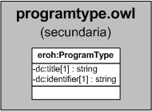

| Fecha         | 15/03/2022                                                   |
| ------------- | ------------------------------------------------------------ |
|Título|Objeto de Conocimiento ProgramType| 
|Descripción|Descripción del objeto de conocimiento ProgramType para Hércules|
|Versión|1.0|
|Módulo|Documentación|
|Tipo|Especificación|
|Cambios de la Versión|Versión inicial|

# Hércules ED. Objeto de conocimiento ProgramType

La entidad eroh:ProgramType (ver Figura 1) representa el tipo de programa en el Curriculum Vitae en la plataforma Hércules. Dispone de varias opciones:
- Arquitectura
- Arquitectura técnica
- Diplomatura
- Doctorado/a
- Ingeniería
- Ingeniería técnica
- Licenciatura
- Máster oficial
- Otros

*Figura 1. Diagrama ontológico para la entidad eroh:ProgramType*
