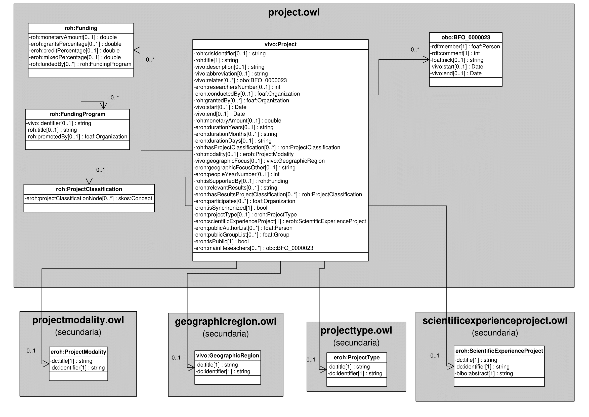

| Fecha         | 09/12/2021                                                   |
| ------------- | ------------------------------------------------------------ |
|Título|Objeto de Conocimiento Proyecto| 
|Descripción|Descripción del objeto de conocimiento Proyecto para Hércules|
|Versión|1.0|
|Módulo|Documentación|
|Tipo|Especificación|
|Cambios de la Versión|Versión inicial|

# Hércules ED. Objeto de conocimiento Proyecto

La entidad vivo:Project (ver Figura 1) representa proyectos de investigación en la plataforma Hércules. Su configuración está inspirada en swrc:Project y toma en consideración propiedades de cerif:Project y vivo:Project.
Además de incluir propiedades pertenecientes a estas entidades, añade otras nuevas como, por ejemplo, roh:modality o roh:title.

Una instancia de vivo:Project incluye una propiedad eroh:hasProjectClassification que permite asociar el proyecto con diferentes instancias de áreas temáticas, como skos:Concept. De este modo, un proyecto puede ser clasificado según las categorías definidas en la jerarquía representada por el esquema de roh:ProjectClassification.
Del mismo modo, una instancia de vivo:Project está asociada con estas otras entidades a través de propiedades de objeto:

- obo:BFO_0000023, que contiene información sobre los periodos de participación de un investigador en un proyecto, su firma o la entidad foaf:Person a la que apunta.
- foaf:Organization, que vincula un proyecto de investigación con la entidad en la que se lleva a cabo (eroh:conductedBy), la entidad o entidades financiadoras (eroh:grantedBy) y la entidad o entidades participantes (eroh:participates).
- eroh:ProjectModality, que vincula un proyecto no competitivo con su modalidad (de actividad de desarrollo precompetitiva, de demostración, de investigación industrial, etc.)
- vivo:GeographicRegion, que establece el ámbito geográfico del proyecto.
- eroh:ProjectType, que indica el tipo de proyecto según la naturaleza y características del programa (de coordinación o cooperación).
- eroh:ScientificExperienceProject, que vincula el proyecto con el epígrafe que le corresponde según la norma CVN (competitivo o no competitivo).

A continuación se listan todas aquellas propiedades contenidas en vivo:Project que extienden la ontología fundamental ROH con el fin de ajustarse a las necesidades de Hércules EDMA:

- roh:crisIdentifier
- eroh:isValidated
- vivo:relates
- eroh:scientificExperienceProject
- eroh:publicationsNumber
- eroh:themedAreasNumber
- eroh:collaboratorsNumber
- eroh:projectAuthorization
- eroh:validationStatusProject
- eroh:isProducedBy
- eroh:yearStart
- eroh:yearEnd
- eroh:collaborative
- roh:title
- vivo:description
- eroh:researchersNumber
- eroh:mainResearchers
- eroh:researchers
- eroh:membersProject
- eroh:conductedByTitle
- eroh:conductedBy
- eroh:conductedByType
- eroh:conductedByTypeOther
- vcard:locality
- vcard:hasCountryName
- vcard:hasRegion
- roh:grantedBy
- vivo:start
- vivo:end
- roh:monetaryAmount
- eroh:durationYears
- eroh:durationMonths
- eroh:durationDays
- roh:hasKnowledgeArea
- roh:modality
- vivo:geographicFocus
- eroh:geographicFocusOther
- eroh:peopleYearNumber
- roh:isSupportedBy
- eroh:projectCode
- eroh:subProjectMonetaryAmount
- eroh:grantsPercentage
- eroh:creditPercentage
- eroh:mixedPercentage
- eroh:relevantResults
- eroh:participates
- eroh:projectType

*Figura 1. Diagrama ontológico para la entidad vivo:Project*
