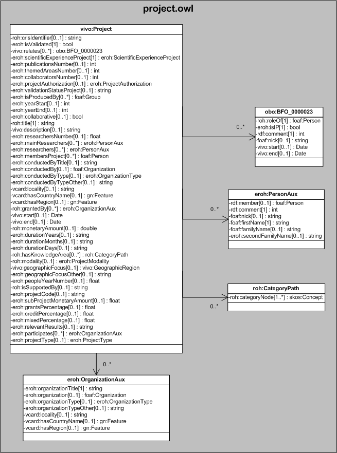

| Fecha         | 09/12/2021                                                   |
| ------------- | ------------------------------------------------------------ |
|Título|Objeto de Conocimiento Project| 
|Descripción|Descripción del objeto de conocimiento Project para Hércules|
|Versión|1.0|
|Módulo|Documentación|
|Tipo|Especificación|
|Cambios de la Versión|Versión inicial|

# Hércules ED. Objeto de conocimiento Project

La entidad vivo:Project (ver Figura 1) representa proyectos de investigación en la plataforma Hércules. Su configuración está inspirada en swrc:Project y toma en consideración propiedades de cerif:Project y vivo:Project.
Además de incluir propiedades pertenecientes a estas entidades, añade otras nuevas como, por ejemplo, roh:modality o roh:title.

Una instancia de vivo:Project incluye una propiedad eroh:hasProjectClassification que permite asociar el proyecto con diferentes instancias de áreas temáticas, como skos:Concept. De este modo, un proyecto puede ser clasificado según las categorías definidas en la jerarquía representada por el esquema de roh:ProjectClassification.
Del mismo modo, una instancia de vivo:Project está asociada con estas otras entidades a través de propiedades de objeto:

- obo:BFO_0000023, que contiene información sobre los periodos de participación de un investigador en un proyecto, su firma o la entidad foaf:Person a la que apunta.
- [eroh:ScientificExperienceProject](https://github.com/HerculesCRUE/Commons-ED-MA/tree/main/ObjetosDeConocimiento/ScientificExperienceProject), que vincula el proyecto con el epígrafe que le corresponde según la norma CVN (competitivo o no competitivo).
- [eroh:ProjectAuthorization](https://github.com/HerculesCRUE/Commons-ED-MA/tree/main/ObjetosDeConocimiento/ProjectAuthorization), representa la autorización asignada al proyecto para enviar a validación como proyecto externo.
- [foaf:Group](), representa el grupo asociado al proyecto.
- eroh:PersonAux, que contiene la información sobre los investigadores principales del proyecto como nombre, apellidos, firma, orden o la entidad foaf:Person a la que apunta.
- [foaf:Person](https://github.com/HerculesCRUE/Commons-ED-MA/tree/main/ObjetosDeConocimiento/Person), representa los miembros asociados al proyecto.
- [foaf:Organization](https://github.com/HerculesCRUE/Commons-ED-MA/tree/main/ObjetosDeConocimiento/Organization), representa las entidades asociadas con el ítem.
- [eroh:OrganizationType](https://github.com/HerculesCRUE/Commons-ED-MA/tree/main/ObjetosDeConocimiento/OrganizationType), representa el tipo de entidad asociada.
- [gn:Feature](https://github.com/HerculesCRUE/Commons-ED-MA/tree/main/ObjetosDeConocimiento/Feature), representa el país y la comunidad autónoma o región.
- eroh:OrganizationAux, que vincula un proyecto de investigación con la entidad en la que se lleva a cabo (eroh:conductedBy), la entidad o entidades financiadoras (eroh:grantedBy) y la entidad o entidades participantes (eroh:participates).
- roh:CategoryPath, que indica las áreas temáticas del proyecto.
- [eroh:ProjectModality](https://github.com/HerculesCRUE/Commons-ED-MA/tree/main/ObjetosDeConocimiento/ProjectModality), que vincula un proyecto no competitivo con su modalidad (de actividad de desarrollo precompetitiva, de demostración, de investigación industrial, etc.)
- [vivo:GeographicRegion](https://github.com/HerculesCRUE/Commons-ED-MA/tree/main/ObjetosDeConocimiento/GeographicRegion), que establece el ámbito geográfico del proyecto.
- [eroh:ProjectType](https://github.com/HerculesCRUE/Commons-ED-MA/tree/main/ObjetosDeConocimiento/ProjectType), que indica el tipo de proyecto según la naturaleza y características del programa (de coordinación o cooperación).

*Figura 1. Diagrama ontológico para la entidad vivo:Project*
