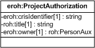

| Fecha         | 15/03/2022                                                   |
| ------------- | ------------------------------------------------------------ |
|Título|Objeto de Conocimiento ProjectAuthorization| 
|Descripción|Descripción del objeto de conocimiento ProjectAuthorization para Hércules|
|Versión|1.0|
|Módulo|Documentación|
|Tipo|Especificación|
|Cambios de la Versión|Versión inicial|

# Hércules ED. Objeto de conocimiento ProjectAuthorization

La entidad eroh:ProjectAuthorization (ver Figura 1) la autorización devuelta por parte del SGI, en el Curriculum Vitae en la plataforma Hércules. 

A continuación se listan todas aquellas propiedades contenidas en eroh:ProjectAuthorization que extienden la ontología fundamental ROH con el fin de ajustarse a las necesidades de Hércules EDMA:

- eroh:crisIdentifier
- roh:title
- eroh:owner

*Figura 1. Diagrama ontológico para la entidad eroh:ProjectAuthorization*
