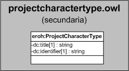

| Fecha         | 15/03/2022                                                   |
| ------------- | ------------------------------------------------------------ |
|Título|Objeto de Conocimiento ProjectCharacterType| 
|Descripción|Descripción del objeto de conocimiento ProjectCharacterType para Hércules|
|Versión|1.0|
|Módulo|Documentación|
|Tipo|Especificación|
|Cambios de la Versión|Versión inicial|

# Hércules ED. Objeto de conocimiento ProjectCharacterType

La entidad eroh:ProjectCharacterType (ver Figura 1) representa el tipo de proyecto en el Curriculum Vitae en la plataforma Hércules. Dispone de varias opciones:
- Proyecto final de carrera
- Tesina
- Tesis doctoral
- Trabajo conducente a obtención de DEA
- Otros

*Figura 1. Diagrama ontológico para la entidad eroh:ProjectCharacterType*
